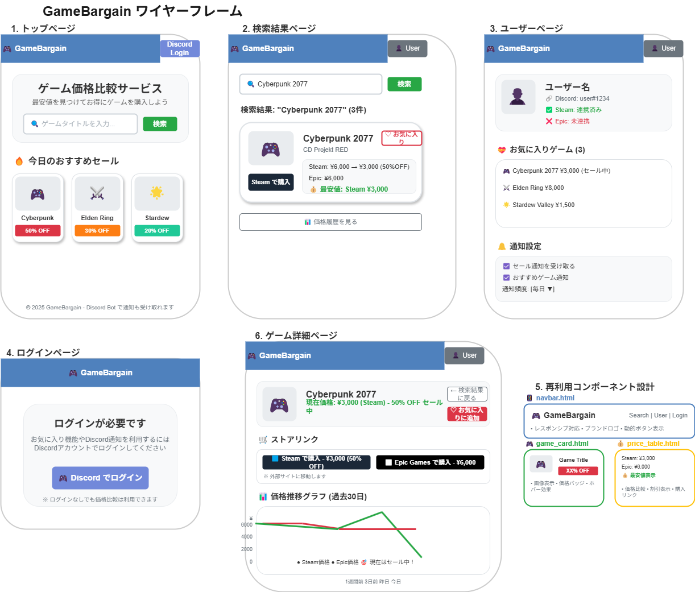

# GameBargain

**ゲーム価格比較・監視サービス**



## 📋 概要

GameBargainは、Steam、Epic Games Store、Origin、Ubisoft Connectなど複数のゲームプラットフォームの価格を比較し、ユーザーが最安値でゲームを購入できるよう支援するWebアプリケーションです。Discord Botと連携した価格通知機能も提供します。

### 🎯 主な機能

- **🔍 ゲーム検索・価格比較**: 複数プラットフォームの価格を一括比較
- **📈 価格履歴・トレンド表示**: 価格推移をグラフで視覚化
- **🤖 Discord Bot連携**: リアルタイム価格通知とBot検索
- **⭐ お気に入り管理**: 気になるゲームを保存・管理
- **🔔 価格監視・通知**: 希望価格到達時の自動通知
- **🏪 ストアリンク**: 各プラットフォームへの直接リンク

## 🚀 開発背景

多くのゲーマーは複数のプラットフォームでゲームの価格を比較する必要がありますが、手動での価格調査は時間がかかります。特に学生などの予算が限られたユーザーにとって、最安値での購入は重要です。GameBargainは、この問題を解決し、ユーザーが効率的に最安値を見つけられるようサポートします。

## 🏗️ プロジェクト構成

```
GameBargain/
├── README.md                 # プロジェクト概要
├── docs/                     # 設計書・図表
│   ├── 要件定義.md
│   ├── 基本設計書.md
│   ├── 詳細設計書.md
│   ├── ER図.drawio.png
│   ├── クラス図.drawio.png
│   ├── システム構成図.drawio.png
│   ├── ワイヤーフレーム.drawio.png
│   └── [シーケンス図など]
├── discord_bot/              # Discord Bot関連
├── web/                      # Webアプリケーション
├── services/                 # ビジネスロジック
├── models/                   # データモデル
├── templates/                # HTMLテンプレート
├── static/                   # CSS/JavaScript/画像
└── data/                     # データファイル
```

## 🛠️ 技術スタック

### Backend
- **Python 3.11+**
- **Flask**: Webフレームワーク
- **SQLAlchemy**: ORM
- **Celery**: 非同期タスク処理
- **Redis**: キャッシュ・メッセージブローカー

### Frontend
- **HTML5/CSS3/JavaScript**
- **Bootstrap 5**: UIフレームワーク
- **Chart.js**: グラフ表示

### Database
- **SQLite**: 開発環境用（簡単セットアップ）
- **PostgreSQL**: 本番環境用

### External APIs
- **Steam Web API**: Steam価格データ
- **Epic Games Store API**: Epic価格データ
- **Discord API**: Bot機能

### Infrastructure
- **Docker**: コンテナ化
- **GitHub Actions**: CI/CD

## 📖 ドキュメント

### 設計書
- [要件定義書](docs/要件定義.md)
- [基本設計書](docs/基本設計書.md)
- [詳細設計書](docs/詳細設計書.md)

### 図表
- [システム構成図](docs/システム構成図.drawio.png)
- [ER図](docs/ER図.drawio.png)
- [クラス図](docs/クラス図.drawio.png)
- [ワイヤーフレーム](docs/ワイヤーフレーム.drawio.png)

## 🔧 セットアップ

### 前提条件

**最小要件（SQLite使用）:**
- Python 3.11以上

**完全な開発環境:**
- Python 3.11以上
- PostgreSQL 14以上（本番環境用）
- Redis 6以上（本番環境用）
- Node.js 18以上（フロントエンド開発用）

### 🚀 クイックスタート（Makefile使用）

最も簡単な方法で開発環境をセットアップできます：

**pip環境の場合：**
```bash
# 1. リポジトリのクローン
git clone https://github.com/saboriyo/GameBargain.git
cd GameBargain

# 2. 開発環境のセットアップ（依存関係インストール + 環境変数設定）
make setup-dev

# 3. 環境変数の編集（必要に応じてAPI キーなどを設定）
cp .env.example .env
nano .env  # または任意のエディタで編集

# 4. アプリケーション起動（SQLiteで自動初期化）
python app.py
```

**conda環境の場合（推奨）：**
```bash
# 1. リポジトリのクローン
git clone https://github.com/saboriyo/GameBargain.git
cd GameBargain

# 2. conda環境での開発環境セットアップ
make setup-dev-conda

# 3. 環境のアクティベート
conda activate gamebargain

# 4. 環境変数の編集（必要に応じてAPI キーなどを設定）
cp .env.example .env
nano .env  # または任意のエディタで編集

# 5. アプリケーション起動（SQLiteで自動初期化）
python app.py
```

🎉 **ブラウザで http://localhost:8000 にアクセスして動作確認！**

利用可能なMakeコマンド：
```bash
make help               # 利用可能なコマンド一覧を表示
make setup-dev          # 開発環境セットアップ（pip）
make setup-dev-conda    # 開発環境セットアップ（conda）
make init-db            # データベース初期化
make dev               # 開発サーバー起動
make test              # テスト実行
make lint              # コード品質チェック
make format            # コード整形
make docker-up         # Docker環境起動
make clean             # 一時ファイル削除
```

### 📋 手動セットアップ

詳細な制御が必要な場合は手動でセットアップできます：

#### 🚀 最小セットアップ（SQLite使用）

1. **リポジトリのクローン**
```bash
git clone https://github.com/saboriyo/GameBargain.git
cd GameBargain
```

2. **仮想環境の作成・有効化**
```bash
# venv使用の場合
python -m venv venv
source venv/bin/activate  # Windows: venv\Scripts\activate

# conda使用の場合（推奨）
conda env create -f environment.yml
conda activate gamebargain
```

3. **依存関係のインストール**
```bash
pip install -r requirements.txt
```

4. **環境変数の設定**
```bash
cp .env.example .env
# 基本的にはそのまま使用可能（SQLite設定済み）
# 必要に応じて.envファイルを編集
```

5. **アプリケーションの起動**
```bash
python app.py
```

6. **ブラウザでアクセス**
   - http://localhost:8000 でアプリケーションが利用可能

#### 🔧 フルセットアップ（PostgreSQL + Redis使用）

本番環境に近い構成で開発する場合：

1. **上記1-3の手順を実行**

2. **PostgreSQL・Redisのインストール・起動**
```bash
# macOS (Homebrew)
brew install postgresql redis
brew services start postgresql
brew services start redis

# Ubuntu/Debian
sudo apt-get install postgresql redis-server
sudo systemctl start postgresql
sudo systemctl start redis-server
```

3. **データベースの作成**
```bash
createdb gamebargain
```

4. **環境変数の設定（PostgreSQL用）**
```bash
cp .env.example .env
# .envファイルを編集してPostgreSQL接続情報を設定
```

5. **データベースの初期化**
```bash
flask db upgrade
```

6. **Redis・Celeryの起動**
```bash
# ターミナル1: Celery Worker
celery -A app.celery worker --loglevel=info

# ターミナル2: Celery Beat（スケジューラー）
celery -A app.celery beat --loglevel=info
```

7. **アプリケーションの起動**
```bash
python app.py
```

### 🐳 Docker利用の場合

```bash
# Docker環境での起動
docker-compose up -d

# または Makefile経由
make docker-up
```

## ⚡ 超簡単セットアップ（SQLite使用）

**最短5分でGameBargainを起動！**

```bash
# 1. クローン
git clone https://github.com/saboriyo/GameBargain.git
cd GameBargain

# 2. 依存関係インストール
pip install -r requirements.txt

# 3. 環境変数設定
cp .env.example .env

# 4. 起動
python app.py
```

✅ **完了！** http://localhost:8000 でアプリケーションが利用可能です。

> **💡 Tip**: この方法では SQLite を使用するため、PostgreSQL や Redis のインストールは不要です。

## 🎮 使用方法

### Webアプリケーション
1. ブラウザで `http://localhost:8000` にアクセス
2. ゲーム名を検索して価格比較
3. お気に入り登録・価格監視設定
4. Discord連携でリアルタイム通知

### Discord Bot
1. BotをDiscordサーバーに招待
2. `/search [ゲーム名]` でゲーム検索
3. `/favorite` でお気に入り管理
4. `/notify` で価格通知設定

## 🧪 テスト

```bash
# 単体テスト
pytest tests/unit/

# 統合テスト
pytest tests/integration/

# 全テスト
pytest
```

## 📈 監視・メトリクス

### ダッシュボード
- アプリケーションメトリクス: `/metrics`
- ヘルスチェック: `/health`
- API使用状況: `/api/stats`

### ログ
- アプリケーションログ: `logs/app.log`
- エラーログ: `logs/error.log`
- API呼び出しログ: `logs/api.log`

## 🤝 コントリビューション

1. このリポジトリをフォーク
2. フィーチャーブランチを作成 (`git checkout -b feature/amazing-feature`)
3. 変更をコミット (`git commit -m 'Add amazing feature'`)
4. ブランチにプッシュ (`git push origin feature/amazing-feature`)
5. プルリクエストを作成

## 📄 ライセンス

このプロジェクトはMITライセンスの下で公開されています。詳細は [LICENSE](LICENSE) ファイルを参照してください。

## 👥 開発チーム

- [@saboriyo](https://github.com/saboriyo) - メイン開発者

## 📞 サポート

- Issues: [GitHub Issues](https://github.com/saboriyo/GameBargain/issues)
- Discord: GameBargain公式サーバー
- Email: support@gamebargain.dev

---

**GameBargain** - あなたのゲーム購入をもっとお得に 🎮💰

## 🗄️ データベース設定

### SQLite（開発・テスト用）

デフォルトでは SQLite を使用します。data/gamebargain.db にデータが保存されます。dataディレクトリを作成し、そこにデータベースファイルを配置します。

```bash
# .envファイル（デフォルト設定）
DATABASE_URL=sqlite:///data/gamebargain.db
SQLALCHEMY_DATABASE_URI=sqlite:///data/gamebargain.db
```

**メリット:**
- ✅ 簡単セットアップ（インストール不要）
- ✅ ファイルベース（`data/gamebargain.db`）
- ✅ 開発・プロトタイピングに最適

**制限:**
- ⚠️ 同時接続数に制限あり
- ⚠️ 本番環境には不向き

### Migrationについて
Flask-Migrateを使用してデータベースのマイグレーションを管理します。初期化後は以下のコマンドでマイグレーションを実行できます。

```bash
flask db init          # マイグレーションディレクトリの初期化
flask db migrate
flask db upgrade       # マイグレーションの適用
```