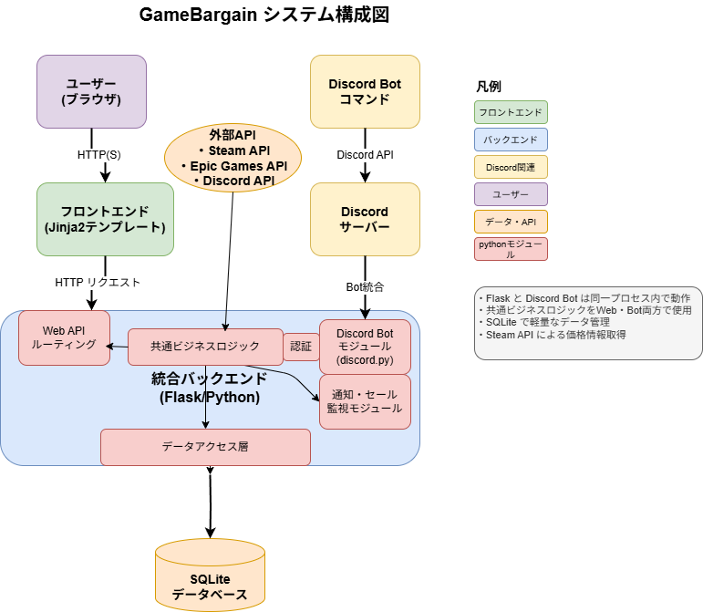

# GameBargain 基本設計書

## 目次
1. [システム構成設計](#1-システム構成設計)
2. [機能設計](#2-機能設計)
3. [画面設計](#3-画面設計)
4. [データ設計](#4-データ設計)
5. [API設計](#5-api設計)
6. [セキュリティ設計](#6-セキュリティ設計)

---

## 1. システム構成設計

### 1.1 システム全体構成図


### 1.2 技術スタック
| 分類 | 技術 | 理由 |
|------|------|------|
| フロントエンド | Jinja2 + TailwindCSS | サーバーサイドレンダリング、開発効率良 |
| JavaScript | Vanilla JS（最小限） | 軽量、学習コスト低 |
| バックエンド | Flask + Discord.py | Python統一、軽量 |
| データベース | SQLite | ファイルベース、運用コスト低 |
| 認証 | Discord OAuth2 | Discord連携がしやすい |
| デプロイ | 自宅鯖/学科サーバー | コスト削減 |

### 1.3 プロジェクト構成
```
GameBargain/
├── README.md                   # プロジェクト概要
├── app.py                      # メインアプリケーション
├── config.py                   # 設定ファイル
├── requirements.txt            # 依存関係
├── docker-compose.yml          # Docker設定
├── Dockerfile                  # Dockerイメージ定義
├── .env.example                # 環境変数サンプル
├── .gitignore                  # Git除外設定
├── LICENSE                     # ライセンス
├── docs/                       # 設計書・図表
│   ├── 要件定義.md
│   ├── 基本設計書.md
│   ├── 詳細設計書.md
│   ├── ER図.drawio.png
│   ├── クラス図.drawio.png
│   ├── システム構成図.drawio.png
│   ├── ワイヤーフレーム.drawio.png
│   └── [各種シーケンス図]
├── discord_bot/                # Discord Bot モジュール
│   ├── __init__.py
│   ├── bot.py                  # Bot実装
│   └── commands.py             # コマンド定義
├── web/                        # Web関連
│   ├── __init__.py
│   ├── routes.py               # Flaskルート
│   ├── auth.py                 # 認証処理
│   ├── forms.py                # フォーム処理
│   └── api.py                  # API エンドポイント
├── services/                   # 共通ビジネスロジック
│   ├── __init__.py
│   ├── game_service.py         # ゲーム検索・価格比較
│   ├── price_service.py        # 価格監視・更新
│   ├── notification_service.py # 通知処理
│   └── discord_service.py      # Discord連携
├── models/                     # データモデル
│   ├── __init__.py
│   ├── user.py                 # ユーザーモデル
│   ├── game.py                 # ゲームモデル
│   ├── store.py                # ストアモデル
│   ├── price.py                # 価格モデル
│   ├── favorite.py             # お気に入りモデル
│   └── notification.py         # 通知モデル
├── templates/                  # Jinja2テンプレート
│   ├── base.html               # ベーステンプレート
│   ├── components/             # 再利用コンポーネント
│   │   ├── navbar.html         # ナビゲーションバー
│   │   ├── game_card.html      # ゲームカード
│   │   └── price_table.html    # 価格テーブル
│   ├── index.html              # トップページ
│   ├── search.html             # 検索結果
│   ├── user.html               # ユーザーページ
│   ├── login.html              # ログインページ
│   └── game_detail.html        # ゲーム詳細ページ
├── static/                     # 静的ファイル
│   ├── css/                    # スタイルシート
│   ├── js/                     # JavaScript
│   └── images/                 # 画像ファイル
├── tests/                      # テストコード
│   ├── unit/                   # 単体テスト
│   └── integration/            # 統合テスト
├── logs/                       # ログファイル
├── data/                       # データファイル
│   └── gamebargain.db          # SQLiteデータベース
└── .github/                    # GitHub Actions
    └── workflows/              # CI/CD設定
        └── ci.yml              # CI/CDパイプライン
```

### 1.4 Discord Bot 統合設計

#### 統合のメリット
- **コード共有**: 価格比較ロジックをWeb・Bot両方で使用
- **データベース統一**: 同一SQLiteインスタンス使用
- **リアルタイム通知**: 価格変動時に即座にDiscord通知
- **運用効率**: 単一プロセス・単一デプロイで管理

#### 統合実装方針
- **単一プロセス**: Flask WebアプリとDiscord Botを同一プロセスで実行
- **共通サービス**: 価格比較・データアクセスロジックを共有
- **別スレッド実行**: Botは別スレッドで非同期実行

---

## 2. 機能設計

#### 2.0 MVP機能一覧
| 機能ID | 機能名 | 優先度 | 工数 | 説明 |
|--------|---------|---------|------|------|
| F001 | ゲーム検索 | 最高 | 3日 | Steam APIでゲーム検索 |
| F002 | 価格比較 | 最高 | 4日 | 複数ストアの価格比較・最安値表示 |
| F003 | Discord認証 | 高 | 3日 | OAuth2によるログイン |
| F004 | ストアリンク | 高 | 1日 | 購入ページへの直接リンク |
| F006 | Discord Bot | 中 | 4日 | 基本的なBot機能 |
| F027 | お気に入り | 中 | 2日 | ゲームのお気に入り登録 |
| F029 | 価格監視 | 中 | 3日 | 価格変動監視・通知 |

## 2. 機能一覧

### 2.1 主要機能
| 機能ID | 機能名 | 説明 | 優先度 | 対応業務 |
|:---|:---|:---|:---|:---|
| F001 | ゲーム検索機能 | Steam/Epic Gamesを対象に、タイトルでゲームを検索する。 | 最高 | GC001 |
| F002 | 価格比較機能 | 複数ストアの価格を比較し、最安値を表示する。 | 最高 | GC002, GC003 |
| F004 | ストアリンク機能 | 各ゲームのストア販売ページへ直接遷移するリンクを提供する。 | 高 | GC005 |

### 2.2 ユーザー・アカウント機能
| 機能ID | 機能名 | 説明 | 優先度 | 対応業務 |
|:---|:---|:---|:---|:---|
| F003 | Discord認証機能 | Discordアカウントを利用したOAuth2認証でログインする。 | 高 | AM001 |
| F027 | お気に入り機能 | 気になるゲームをお気に入りとして登録・管理する。 | 中 | UM001 |

### 2.3 Discord Bot機能
| 機能ID | 機能名 | 説明 | 優先度 | 対応業務 |
|:---|:---|:---|:---|:---|
| F006 | Discord bot機能 | Discordサーバーにbotを追加し、コマンドで機能を利用できる。 | 中 | DB001, DB004 |

### 2.4 価格監視・通知機能
| 機能ID | 機能名 | 説明 | 優先度 | 対応業務 |
|:---|:---|:---|:---|:---|
| F008 | セール通知機能 | お気に入りゲームのセール開始時にDiscord通知を送信する。 | 中 | DB003 |
| F029 | 価格監視機能 | お気に入り登録されたゲームの価格を定期的に自動チェックする。 | 中 | SM001, SM002, DB002, DB003 |

## 2. 機能詳細

#### 主要機能
| 機能ID | 機能名 | 説明 | 優先度 | 対応業務 | 前提条件 | 事後条件 | 入力項目 | 出力項目 |
|--------|---------|------|---------|-----------|----------|----------|----------|----------|
| F001 | ゲーム検索機能 | ゲームタイトルによる検索 | 高 | GC001 | なし | 検索結果が表示される | ゲームタイトル | ゲーム一覧、価格情報 |
| F002 | 価格比較機能 | 複数ストアの価格比較 | 高 | GC002, GC003 | ゲームが選択されている | 価格比較結果が表示される | ゲーム情報 | 各ストア価格、最安値 |
| F003 | 最安値表示機能 | 最安値の自動表示 | 高 | GC003 | 価格情報が取得済み | 最安値が強調表示される | 価格データ | 最安値情報、割引率 |
| F004 | ストアリンク機能 | 購入ページへの直接リンク | 高 | GC005 | ゲーム情報が表示されている | 外部ストアページに遷移 | ゲーム情報、ストア情報 | 購入リンク |
| F005 | おすすめゲーム表示機能 | セール・人気ゲームの表示 | 中 | RC001, RC002 | なし | おすすめゲームが表示される | なし | おすすめゲーム一覧 |

#### 通知機能
| 機能ID | 機能名 | 説明 | 優先度 | 対応業務 | 前提条件 | 事後条件 | 入力項目 | 出力項目 |
|--------|---------|------|---------|-----------|----------|----------|----------|----------|
| F006 | Discord bot機能 | Discordサーバーへのbot追加 | 中 | DB001 | Discordサーバーの管理権限 | botがサーバーに追加される | サーバー情報 | bot招待リンク |
| F007 | おすすめゲーム通知 | 定期的なおすすめゲーム通知 | 中 | DB002 | botが追加済み | Discord通知が送信される | 通知設定 | おすすめゲーム通知 |
| F008 | セール通知機能 | お気に入りゲームのセール通知 | 中 | DB003 | お気に入りゲームが登録済み | セール開始時に通知される | お気に入りゲーム、セール情報 | セール通知メッセージ |
| F009 | 通知設定機能 | 通知内容・頻度の設定 | 低 | DB005 | ユーザーがログイン済み | 通知設定が保存される | 通知頻度、通知内容 | 設定確認画面 |

#### アカウント機能
| 機能ID | 機能名 | 説明 | 優先度 | 対応業務 | 前提条件 | 事後条件 | 入力項目 | 出力項目 |
|--------|---------|------|---------|-----------|----------|----------|----------|----------|
| F023 | Discord認証ログイン | Discord OAuth2認証 | 高 | AM001 | Discordアカウントを所有 | ログイン状態になる | Discord認証情報 | ユーザー情報、セッション |
| F024 | プロフィール管理機能 | ユーザー情報の編集・更新 | 中 | AM002 | ログイン済み | プロフィールが更新される | ユーザー情報 | 更新確認メッセージ |
| F025 | アカウント連携機能 | Steam/Epic連携 | 中 | AM003 | ログイン済み | 外部アカウントが連携される | Steam/Epic認証情報 | 連携確認メッセージ |
| F026 | セッション管理機能 | ログイン状態の管理 | 高 | AM004 | ログイン済み | セッションが維持される | セッション情報 | ログイン状態 |

#### ユーザー機能
| 機能ID | 機能名 | 説明 | 優先度 | 対応業務 | 前提条件 | 事後条件 | 入力項目 | 出力項目 |
|--------|---------|------|---------|-----------|----------|----------|----------|----------|
| F027 | お気に入り機能 | お気に入りゲームの管理 | 中 | UM001 | ログイン済み | お気に入りが登録され、Discord botが紹介開始 | ゲーム情報 | お気に入りリスト、bot通知設定 |
| F028 | 設定管理機能 | 個人設定の保存・変更 | 中 | UM002 | ログイン済み | 設定が保存される | 設定項目 | 設定確認画面 |

#### 管理機能
| 機能ID | 機能名 | 説明 | 優先度 | 対応業務 | 前提条件 | 事後条件 | 入力項目 | 出力項目 |
|--------|---------|------|---------|-----------|----------|----------|----------|----------|
| F029 | データ収集機能 | 各ストアからの自動データ収集 | 高 | SM001 | API接続が可能 | 最新データが収集される | なし | ゲーム情報、価格情報 |
| F030 | 価格更新機能 | 価格情報の定期更新 | 高 | SM002 | データ収集が完了 | 価格情報が更新される | 価格データ | 更新ログ |
| F031 | エラーハンドリング | システムエラーの自動処理 | 中 | SM003 | エラーが発生 | エラーが処理される | エラー情報 | エラーログ、復旧状況 |
| F032 | ログ管理機能 | システムログの記録・分析 | 低 | SM004 | システムが動作中 | ログが記録される | システム動作情報 | ログファイル |
| F033 | 監視機能 | システムパフォーマンス監視 | 低 | SM005 | システムが動作中 | パフォーマンスが監視される | システム状態 | 監視レポート |

#### UI/UX機能
| 機能ID | 機能名 | 説明 | 優先度 | 対応業務 | 前提条件 | 事後条件 | 入力項目 | 出力項目 |
|--------|---------|------|---------|-----------|----------|----------|----------|----------|
| F034 | レスポンシブデザイン | PC・スマホ対応UI | 高 | - | なし | 各デバイスで最適表示される | デバイス情報 | 最適化UI |
| F035 | 価格履歴表示 | 価格変動のグラフ表示 | 低 | GC004 | 価格履歴データが存在 | 価格変動グラフが表示される | 価格履歴データ | 価格変動グラフ |
| F036 | カテゴリ別表示 | ジャンル別ゲーム表示 | 低 | RC005 | ゲームデータが存在 | カテゴリ別ゲーム一覧が表示される | カテゴリ情報 | カテゴリ別ゲーム一覧 |
| F037 | 検索フィルター | 詳細検索・絞り込み機能 | 低 | GC001 | ゲームデータが存在 | 絞り込み結果が表示される | フィルター条件 | 絞り込み結果 |


### 2.5 主要機能設計

#### F001: ゲーム検索機能
- **入力値検証**: 最小2文字以上の検索文字列
- **Steam API連携**: 公式Storefront APIでゲーム情報取得
- **価格情報統合**: 検索結果に現在価格・割引情報を付与
- **フィルター機能**: ジャンル・価格帯、評価別、値下がり度、steamが安いかepicが安いかのフィルター

#### F002: 価格比較機能
- **複数ストア対応**: Steam、Epic Games Store価格比較
- **最安値判定**: 現在価格での最もお得なストア選択
- **割引情報表示**: セール価格・割引率の表示

#### F004: ストアリンク機能
- **直接リンク**: 各ストアの購入ページへの直接遷移
- **URL生成**: 動的なストアリンク生成

#### F006: Discord Bot機能
- **ゲーム検索コマンド**: `/search <title>`
- **価格確認コマンド**: `/price <title>`
- **共通サービス**: WebアプリケーションとDB・ロジック共有
- **通知機能**: 価格変動時に指定チャンネルへ通知

#### F027: お気に入り機能
- **登録管理**: ゲームのお気に入り登録・削除
- **通知連携**: お気に入り登録と同時にDiscord bot通知設定

#### F029: 価格監視機能
- **定期監視**: スケジュールによる価格変動チェック
- **自動通知**: 価格変動時のDiscord通知送信

---

## 3. 画面設計

### 3.1 主要画面一覧
1. **トップページ** - ゲーム検索フォーム、おすすめセール
2. **検索結果ページ** - 価格比較結果、購入リンク
3. **ユーザーページ** - お気に入り、通知設定
4. **ログインページ** - Discord OAuth認証
5. **ゲーム詳細ページ** - 価格推移グラフ、ストアリンク、変動履歴

### 3.2 ワイヤーフレーム詳細設計


モダンなデザインシステムと再利用コンポーネントを活用した全画面のワイヤーフレームは上記を参照。

### 3.3 画面構成（簡略版）

#### トップページ
```
┌─────────────────────────────────────────┐
│ GameBargain                    [ログイン] │
├─────────────────────────────────────────┤
│        ゲーム価格比較サービス              │
│  ┌─────────────────┐ [検索]              │
│  │ ゲームタイトル    │                    │
│  └─────────────────┘                    │
│  今日のおすすめセール                      │
│  [ゲーム1 50%OFF] [ゲーム2 30%OFF]       │
└─────────────────────────────────────────┘
```

#### 検索結果ページ
```
┌─────────────────────────────────────────┐
│ 検索結果: "Cyberpunk 2077"               │
│ ┌─────────────────────────────────────┐ │
│ │ Cyberpunk 2077           [♡お気に入り] │ │
│ │ 最安値: Steam ¥3,000                │ │
│ │ [Steamで購入] [�詳細を見る]         │ │
│ └─────────────────────────────────────┘ │
└─────────────────────────────────────────┘
```

#### ゲーム詳細ページ
```
┌─────────────────────────────────────────┐
│ [← 戻る]   🎮 Cyberpunk 2077            │
│ 現在価格: ¥3,000 (Steam) - 50% OFF     │
│                        [♡お気に入り追加] │
├─────────────────────────────────────────┤
│ 🛒 ストアリンク                         │
│ [🟦 Steam - ¥3,000 (50%OFF)]           │
│ [⬜ Epic Games - ¥6,000]                │
├─────────────────────────────────────────┤
│ 📊 価格推移グラフ (過去30日)            │
│ [グラフ表示エリア]                      │
│ 📋 価格変動履歴                         │
└─────────────────────────────────────────┘
```

### 3.4 再利用コンポーネント設計
- **navbar.html** - ブランドロゴ、レスポンシブ対応、動的ボタン表示
- **game_card.html** - 画像、タイトル、価格バッジ、ホバー効果
- **price_table.html** - 価格比較、割引表示、購入リンク

---

## 4. データ設計

### 4.1 テーブル設計概要

| テーブル名 | 説明 | 主要フィールド | 備考 |
|------------|------|----------------|------|
| **users** | ユーザー情報 | user_id, discord_id, username, avatar_url | Discord OAuth2認証によるユーザー管理 |
| **games** | ゲーム情報 | game_id, title, developer, steam_app_id, image_url | Steam APIから取得したゲーム基本情報 |
| **prices** | 価格情報 | price_id, game_id, store, regular_price, sale_price, discount_rate, is_on_sale | 各ストアの価格・セール情報を管理 |
| **user_favorites** | ユーザーお気に入り | favorite_id, user_id, game_id | ユーザーのお気に入りゲーム登録 |
| **user_settings** | ユーザー設定 | setting_id, user_id, notification_enabled, notification_frequency, price_threshold | 通知設定・価格閾値等の個人設定 |
| **notifications** | 通知情報 | notification_id, user_id, game_id, notification_type, title, message, is_sent | 価格変動・セール通知の管理 |
| **discord_settings** | Discord設定 | setting_id, user_id, guild_id, channel_id, bot_enabled, notification_types | Discord Bot通知設定 |

---

## 5. API設計

### 5.1 Web API エンドポイント
```
GET  /                      # トップページ
GET  /search?q={title}      # 検索結果ページ
GET  /game/{id}             # ゲーム詳細ページ（価格推移・ストアリンク含む）
GET  /user                  # ユーザーページ
POST /user/favorites        # お気に入り追加
GET  /auth/discord          # Discord認証
GET  /auth/callback         # 認証コールバック
```

### 5.2 Discord Bot コマンド
```
!gb search <title>          # ゲーム検索
!gb price <title>           # 価格確認
!gb favorite <title>        # お気に入り追加
!gb help                    # ヘルプ表示
```

### 5.3 外部API統合

#### Steam Storefront API（公式）
https://store.steampowered.com/api/appdetails?appids=APPID
- **検索API**: 非公式だが安定した検索エンドポイント
- **アプリ詳細API**: `appdetails` で価格・ゲーム情報取得
- **レート制限**: 一般的に10req/sec程度、適切な間隔制御が必要
- **価格形式**: センテージ単位（5980円→598000）、通貨コード付き

#### Epic Games Store API（非公式）
https://store-site-backend-static.ak.epicgames.com/freeGamesPromotions
- **GraphQL API**: 非公式、構造変更リスク有り
- **スクレイピング**: バックアップ手段として検討
- **レート制限**: 厳しい、必ずキャッシュ・間隔制御実装
- **認証**: 基本的に不要だが、IP制限の可能性
 


**推奨実装戦略**:
1. **Steam API中心**: メインの価格情報源として利用
2. **Epic Games**: 価格比較の補完として利用
3. **スクレイピング**: 最終手段として、APIが利用不可
3. **フォールバック**: API失敗時の代替手段を用意
4. **キャッシュ戦略**: API呼び出しを最小限に抑制
5. **監視機能**: API可用性の継続監視
6. **ユーザー通知**: API制限時の適切な情報提供


**バッチ処理の設計方針**：
- **効率的なAPI利用**: レート制限遵守、一括処理優先
- **エラー耐性**: 単一ゲームの失敗が全体に影響しない
- **段階的展開**: 初期は手動実行、後に自動スケジュール化
- **監視・ログ**: API成功率・実行時間・エラー詳細の記録

---

## 6. セキュリティ設計

### 6.1 基本セキュリティ対策
- **Discord OAuth2**: 安全なユーザー認証
- **CSRF対策**: Flask-WTF使用
- **SQL Injection対策**: パラメータ化クエリ
- **XSS対策**: Jinja2の自動エスケープ
- **環境変数**: 機密情報の適切な管理

### 6.2 API制限
- **レート制限**: Steam API呼び出し頻度制限
- **エラーハンドリング**: 適切なエラーレスポンス
- **ログ監視**: 異常なアクセスパターンの検知

---

## 7. 開発・運用

### 7.1 開発環境
- **Python 3.9+**: Flask, discord.py, requests, python-dotenv
- **データベース**: SQLite
- **フロントエンド**: HTML/CSS/JavaScript, Tailwind CSS
- **環境変数**: `.env`ファイルで機密情報管理
```
DISCORD_BOT_TOKEN=your_bot_token
STEAM_API_KEY=your_steam_api_key
```

### 7.2 デプロイ・運用
- **単一プロセス**: Flask + Discord Bot統合実行
- **データベース**: SQLiteファイルベース
- **Dockerでまとめて、Gitlab CI/CDで自動デプロイ**

---

