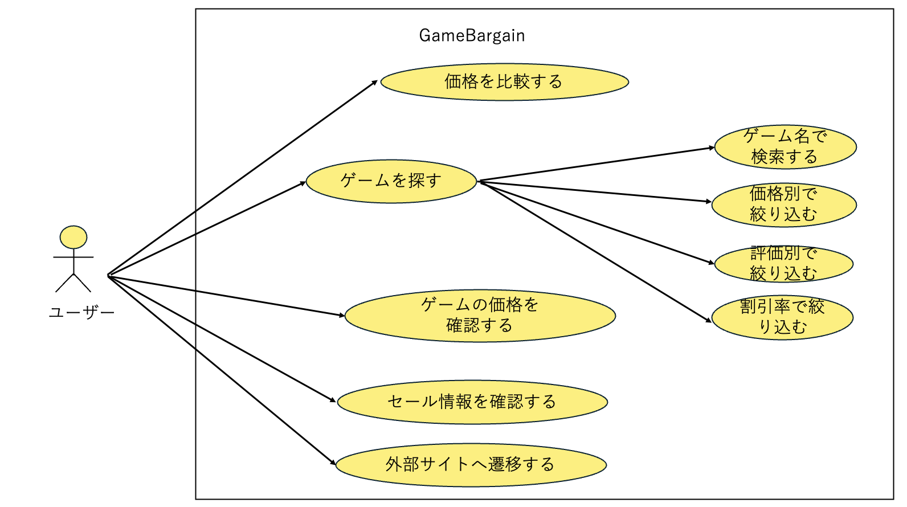

# 要件定義
## 目次
1. 目的
1. ユースケース
1. 機能要件
- ゲーム価格比較機能
    - ゲーム検索
    - 価格表示
    - ストアリンク
- おすすめゲーム表示
- Discord bot機能
    - おすすめゲームの通知
- アカウント機能
    - Discord認証ログイン
    - プロフィール管理
    - アカウント連携
- ユーザーインターフェース
    - レスポンシブデザイン
    - ユーザーフレンドリーなナビゲーション
    - 画面遷移図
1. 非機能要件
- インフラ
- ユーザビリティ
1. データベース設計
1. 業務一覧
1. 機能一覧


## 目的
　現在、ゲームを購入する際に、どのストアで購入するのが最も安いかを調べるのは手間がかかる。これを自動化してまとめることで、ユーザーが簡単に最安値を見つけることができるようにする。また、セール情報やおすすめゲームの通知機能を提供することで、ユーザーのゲーム購入体験を向上させる。
- 特に学生やお金がない人にとって、ゲームを安く購入することは重要な要素であるため、このサイトはそのニーズに応えることを目的とする。

## ユースケース

## 機能要件
### ゲーム価格比較機能
- ユーザーがゲームのタイトルを入力すると、ゲーム販売サイトから価格を比較し、最も安い購入先を表示する。
- 以下の主要ゲーム販売サイトから価格を取得する。
  - Steam
  - Epic Games
- 検索結果は、ゲームのタイトル、通常価格、セール価格、ストアリンクを含み、価格はリアルタイムで更新され、最新の情報を提供する。

### おすすめゲーム表示
- ユーザーが今買うべきゲームを表示する機能を提供する。
- おすすめゲームは、セール情報や人気のゲームを基に表示される

### Discord bot機能
- botをユーザーのDiscordサーバーに追加することで、ゲームのおすすめ情報を通知する。
- お気に入りのゲームのセール情報を通知する機能を提供する。

### アカウント機能
- Discord認証によるログイン機能を提供し、個人設定やお気に入りゲームを管理する。
- Steam、Epic Gamesアカウントとの連携機能を提供する。
- プロフィール編集機能により、ユーザー情報の管理を行う。
- セッション管理によりログイン状態を維持する。

### ユーザーインターフェース
- レスポンシブデザインを採用し、PCやスマートフォンなど、様々なデバイスで快適に利用できるようにする。
- 多くの情報を表示でき、ユーザーフレンドリーなナビゲーションを提供する。
#### 画面遷移図


## 非機能要件
### インフラ
- 自宅鯖か学科サーバーを使用して、お金を使わないで運用する。
### ユーザビリティ
- ゲーマーが使いやすくDisocrdやsteam、epicとの連携を意識する

## データベース設計
### テーブル構成
1. **users** - ユーザー情報・Discord認証管理・アカウント管理
2. **games** - ゲーム基本情報・メタデータ・ストア連携ID
3. **prices** - 現在価格情報（各ストアの最新価格のみ）
4. **price_history** - 価格変動履歴（価格変動時に蓄積される時系列データ）
5. **user_favorites** - お気に入りゲーム管理・通知設定
6. **user_settings** - ユーザー個別設定・通知設定・言語設定
7. **notifications** - 通知履歴・送信ステータス管理
8. **discord_settings** - Discord bot設定・チャンネル管理・通知設定
9. **system_logs** - システムログ・エラー監視・パフォーマンス記録

### データベース設計方針
#### 価格データの分離設計
- **pricesテーブル**: 現在価格のみ（最大2レコード/ゲーム：Steam・Epic）
- **price_historyテーブル**: 価格変動履歴（変動時のみ蓄積）
- **分離理由**: 頻繁アクセスする現在価格と分析用履歴の分離によるパフォーマンス向上

#### APIとの連携
- Steam/Epic Games APIから**現在価格のみ**取得可能
- 価格変動は**価格が変わった時のみ**price_historyテーブルに保存
- APIレート制限対応のキャッシュ戦略を適用


## 業務一覧

### ゲーム価格比較機能
| 識別子 | 業務名 | 概要 | 備考 |
|--------|---------|------|------|
| GC001 | ゲーム検索 | ゲームタイトルによる検索機能 | Steam、Epic Games対応 |
| GC002 | 価格取得 | 各ストアからの価格情報取得 | リアルタイム更新 |
| GC003 | 価格比較 | 取得した価格の比較・最安値表示 | 通常価格、セール価格含む |
| GC004 | 価格履歴表示 | ゲームの価格変動履歴を表示 | 価格変動時に蓄積されたデータからグラフ生成 |
| GC005 | ストアリンク生成 | 各ストアへのリンク生成 | 購入ページへの直接リンク |

### おすすめゲーム機能
| 識別子 | 業務名 | 概要 | 備考 |
|--------|---------|------|------|
| RC001 | おすすめゲーム取得 | セール情報・人気ゲームの取得 | 各ストアAPI連携 |
| RC002 | おすすめゲーム表示 | 今買うべきゲームの表示 | ランキング形式 |
| RC003 | セール情報管理 | セール情報の収集・管理 | 期間限定セール対応 |
| RC004 | 人気ゲーム分析 | 人気ゲームの分析・抽出 | ユーザー評価、売上データ |
| RC005 | カテゴリ別表示 | ジャンル別おすすめゲーム表示 | アクション、RPG等 |

### Discord bot機能
| 識別子 | 業務名 | 概要 | 備考 |
|--------|---------|------|------|
| DB001 | bot登録 | Discordサーバーへのbot追加 | 認証・権限設定 |
| DB002 | おすすめゲーム通知 | おすすめゲームの自動通知 | 定期通知機能 |
| DB003 | セール通知 | お気に入りゲームのセール通知 | ユーザー設定に基づく |
| DB004 | コマンド処理 | Discord内でのコマンド実行 | 検索、価格確認等 |
| DB005 | 通知設定管理 | 通知頻度・内容の設定管理 | ユーザー個別設定 |

### アカウント管理機能
| 識別子 | 業務名 | 概要 | 備考 |
|--------|---------|------|------|
| AM001 | Discord認証 | Discord OAuth2認証処理 | 初回登録も含む |
| AM002 | プロフィール管理 | ユーザー情報の編集・更新 | アバター設定等 |
| AM003 | アカウント連携 | Steam/Epic連携 | OAuth認証 |
| AM004 | セッション管理 | ログイン状態の管理 | Flaskセッション機能使用、クッキーベース |

### ユーザー管理機能
| 識別子 | 業務名 | 概要 | 備考 |
|--------|---------|------|------|
| UM001 | お気に入り管理 | お気に入りゲームの登録・管理 | 通知設定と連携 |
| UM002 | 設定管理 | 通知設定、表示設定等の管理 | 個人設定保存 |

### システム管理機能
| 識別子 | 業務名 | 概要 | 備考 |
|--------|---------|------|------|
| SM001 | データ収集 | 各ストアからのデータ自動収集 | 定期実行バッチ（価格変動チェック） |
| SM002 | データ更新 | 価格情報の定期更新 | 価格変動時のみpricesテーブルに保存 |
| SM003 | エラーハンドリング | API接続エラー等の処理 | 自動復旧機能 |
| SM004 | ログ管理 | システムログの記録・管理 | 監視・分析用 |
| SM005 | パフォーマンス監視 | システムパフォーマンス監視 | 負荷分散対応 |

## 業務フロー

### ゲーム価格比較フロー
```
1. ユーザーがゲームタイトルを入力 (GC001)
2. Steam、Epic GamesのAPIから価格情報を取得 (GC002)
3. 取得した価格を比較し、最安値を算出 (GC003)
4. 価格履歴データと合わせて表示 (GC004)
5. 各ストアへの購入リンクを生成 (GC005)
```

### おすすめゲーム表示フロー
```
1. 各ストアからセール情報を取得 (RC001, RC003)
2. 人気ゲームデータを分析 (RC004)
3. カテゴリ別におすすめゲームを整理 (RC005)
4. ランキング形式で表示 (RC002)
```

### Discord bot通知フロー
```
1. ユーザーがDiscordサーバーにbotを追加 (DB001)
2. お気に入りゲームを設定 (UM001)
3. 通知設定を管理 (DB005)
4. 定期的にセール情報をチェック (RC003)
5. 条件に合致した場合、Discord通知を送信 (DB002, DB003)
```

### アカウント管理フロー
```
1. Discord OAuth2認証でログイン (AM001)
2. Steam、Epic連携設定 (AM003)
3. セッション管理によるログイン状態維持 (AM004)
4. プロフィール情報の編集・更新 (AM002)
```

### 価格変動監視フロー
```
1. 定期的にAPIから価格取得 (SM001)
2. 前回価格と比較して変動チェック (SM002)
3. 価格変動時のみpricesテーブルに保存 (SM002)
4. セール開始/終了時にDiscord通知 (DB003)
```

### ユーザー管理フロー
```
1. お気に入りゲーム設定 (UM001)
2. 通知設定・表示設定 (UM002)
```

### システム運用フロー
```
1. 定期的な価格監視バッチ実行 (SM001)
2. 価格変動時のみデータ保存 (SM002)
3. エラー発生時の自動復旧処理 (SM003)
4. システムログの記録・監視 (SM004)
5. パフォーマンス監視・負荷分散 (SM005)
```


## 機能連携の詳細

### Discord認証→お気に入り登録→Discord bot通知の流れ
1. **Discord認証ログイン (F003)**
   - 前提条件: Discordアカウントを所有
   - 事後条件: ログイン状態になり、個人機能が利用可能

2. **お気に入り機能 (F027)**
   - 前提条件: ログイン済み
   - 事後条件: お気に入りが登録され、Discord botが自動的にそのゲームを通知対象に追加
   - 連携効果: お気に入り登録と同時に、Discord bot通知設定が自動更新される

3. **Discord bot機能 (F006)**
   - 前提条件: Discordサーバーの管理権限
   - 事後条件: botがサーバーに追加され、お気に入りゲームの情報を定期通知

4. **セール通知機能 (F008)**
   - 前提条件: お気に入りゲームが登録済み + botが追加済み
   - 事後条件: お気に入りゲームがセールになると自動でDiscord通知が送信される

5. **価格監視機能 (F029)**
   - 前提条件: システムが動作中
   - 事後条件: 定期的に価格チェックを実行し、変動時に通知を送信

### 機能連携の具体例
- ユーザーがDiscordでログイン → 「Cyberpunk 2077」をお気に入り登録
- → Discord botが自動的に「Cyberpunk 2077」の価格監視開始
- → セール開始時に「【セール情報】Cyberpunk 2077が50%OFF！Steam: ¥3,000」のような通知がDiscordに送信

