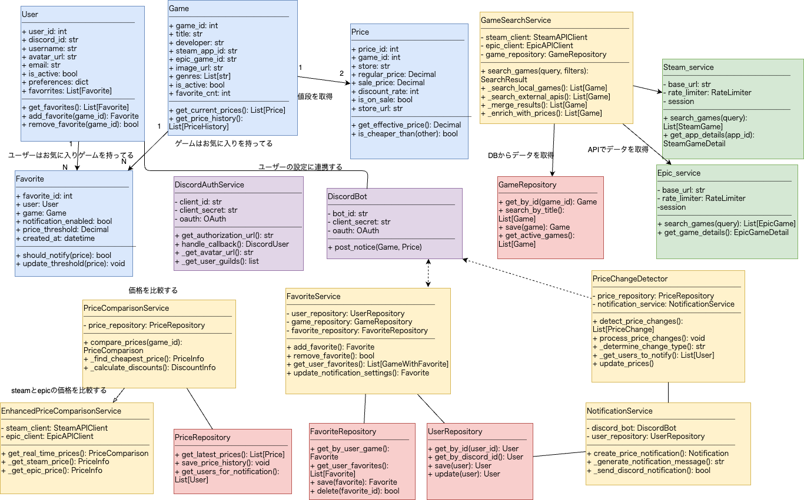
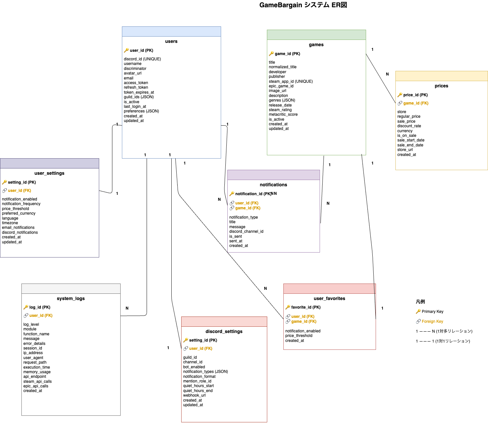
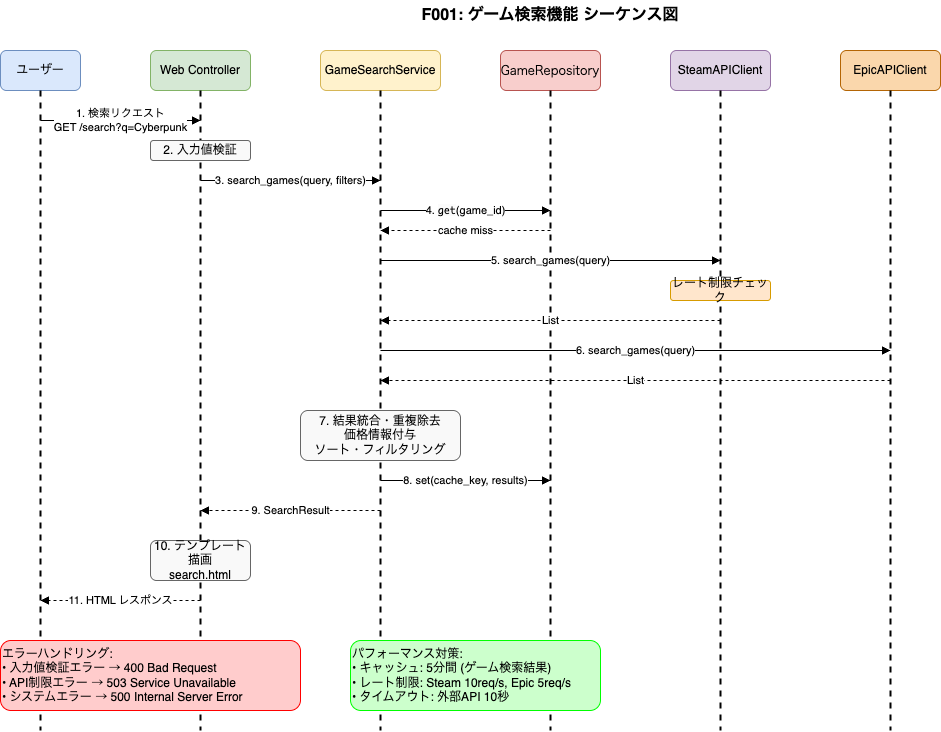
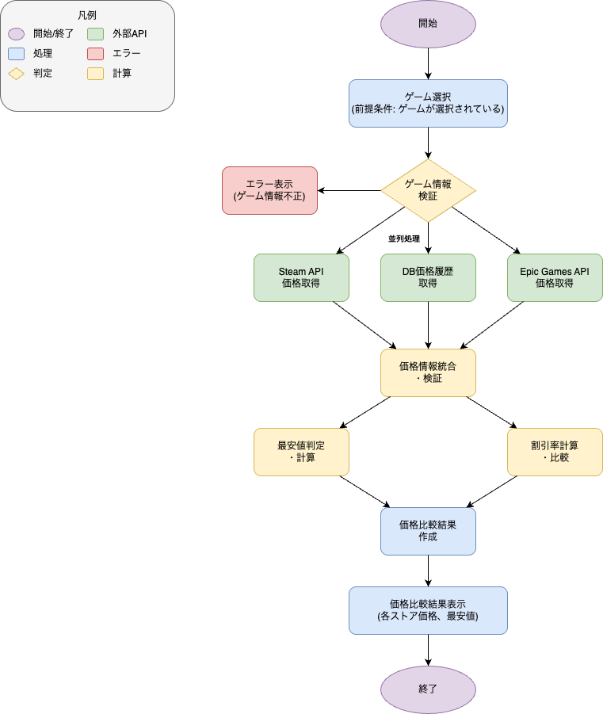
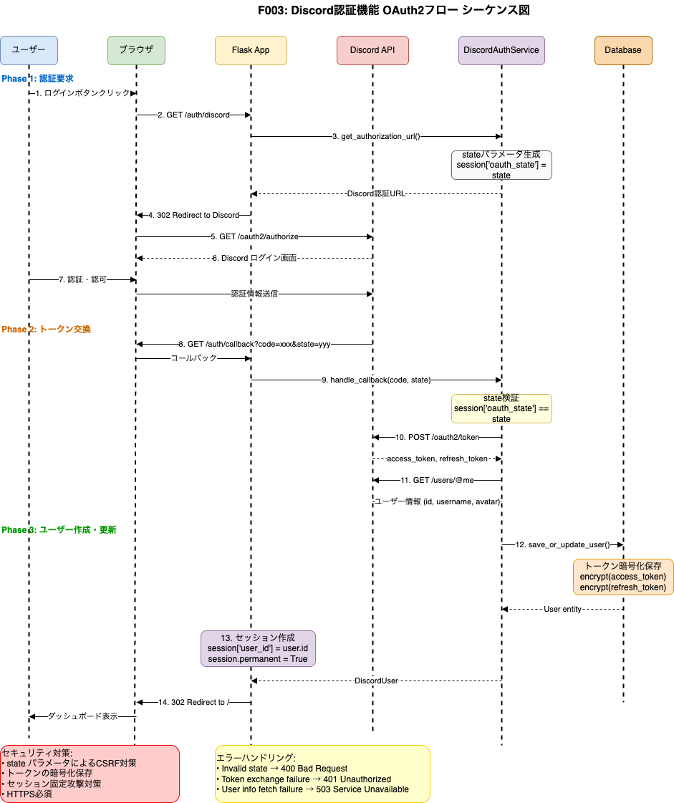
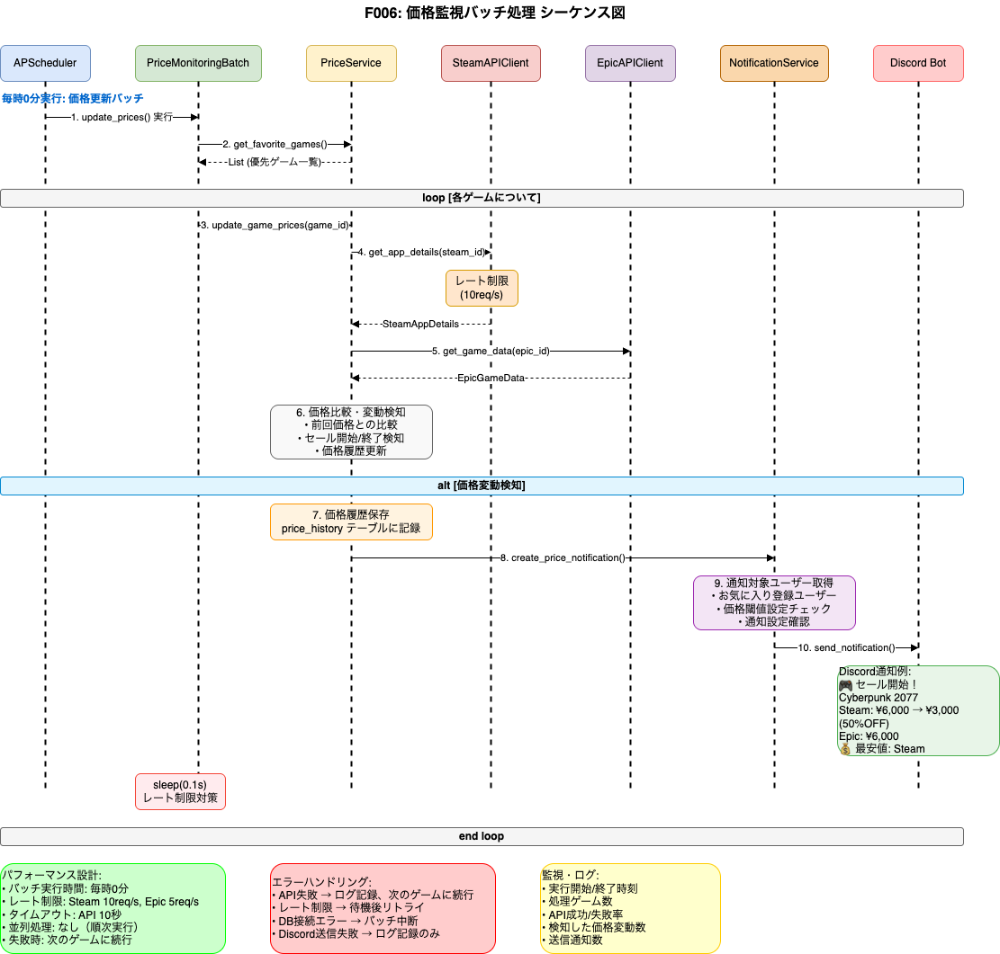

# GameBargain 詳細設計書


## 1. 概要

### 1.1 設計方針
- **単一責任原則**: 各クラス・モジュールは明確な責任を持つ
- **依存性注入**: テスタビリティと保守性を向上
- **レイヤードアーキテクチャ**: プレゼンテーション、ビジネス、データアクセスの分離
- **非同期処理**: Discord Bot、価格監視バッチの非同期実行

### 1.2 技術仕様詳細
| 項目 | 技術 | バージョン | 用途 |
|------|------|-----------|------|
| Python | 3.9+ | - | メイン言語 |
| Flask | 2.3+ | - | Webフレームワーク |
| Discord.py | 2.3+ | - | Discord Bot |
| SQLAlchemy | 2.0+ | - | ORM |
| Alembic | 1.11+ | - | DBマイグレーション |
| Flask-WTF | 1.1+ | - | フォーム・CSRF対策 |
| Requests | 2.31+ | - | HTTP クライアント |
| APScheduler | 3.10+ | - | スケジューラ |
| Authlib | 1.2+ | - | OAuth2クライアント |

### 1.3 パフォーマンス要件
| 項目 | 目標値 | 備考 |
|------|--------|------|
| 同時接続ユーザー数 | 100人 | 想定最大値 |
| API応答時間 | 95%ile 2秒以下 | 外部API依存を除く |
| DB接続プール | 10-20接続 | SQLAlchemy設定 |
| セッション有効期限 | 30日 | Discord認証標準 |
| キャッシュTTL | 5-60分 | データ種別により調整 |

### 1.4 開発期間
- **期間**: 1ヶ月
- **フェーズ**: 以下のスケジュールに基づいて進行

#### 開発スケジュール
| フェーズ | 期間 | 内容 |
|----------|------|------|
| Phase 1 | 1週間 | 基盤機能の実装 |
| Phase 2 | 1週間 | ユーザー機能の実装 |
| Phase 3 | 1週間 | Discord Botの開発 |
| Phase 4 | 1週間 | 価格監視・通知機能の実装 |

---

## 2. アーキテクチャ設計

### 2.1 レイヤー構成
```
┌─────────────────────────────────────┐
│ Presentation Layer (Web UI)         │
│ - Flask Routes                      │
│ - Jinja2 Templates                  │
│ - Static Files                      │
├─────────────────────────────────────┤
│ Application Layer                   │
│ - Web Controllers                   │
│ - Discord Bot Commands              │
│ - API Endpoints                     │
├─────────────────────────────────────┤
│ Domain/Service Layer                │
│ - Game Service                      │
│ - Price Service                     │
│ - User Service                      │
│ - Notification Service              │
├─────────────────────────────────────┤
│ Infrastructure Layer                │
│ - External API Clients              │
│ - Database Access                   │
│ - Authentication                    │
└─────────────────────────────────────┘
```

### 2.2 モジュール依存関係


### 2.3 クラス図


#### 2.3.1 主要クラス構成

**データモデル (青色):**
- **User**: ユーザーエンティティ - Discord認証情報、プリファレンス
- **Game**: ゲームエンティティ - Steam/Epic Game ID、メタデータ
- **Price**: 価格エンティティ - 現在価格、セール情報
- **Favorite**: お気に入りエンティティ - 通知設定、価格閾値

**サービス層 (黄色):**
- **GameSearchService**: ゲーム検索・外部API統合
- **PriceComparisonService**: 価格比較・分析
- **EnhancedPriceComparisonService**: リアルタイム価格取得 (継承)
- **FavoriteService**: お気に入り管理・通知設定
- **NotificationService**: 通知作成・Discord送信
- **PriceChangeDetector**: 価格変動検知・自動通知

**外部APIクライアント (緑色):**
- **SteamAPIClient**: Steam Web API連携・レート制限管理
- **EpicAPIClient**: Epic Games Store API連携

**リポジトリ層 (赤色):**
- **UserRepository**: ユーザーデータアクセス
- **GameRepository**: ゲームデータアクセス・検索
- **PriceRepository**: 価格データアクセス・履歴管理
- **FavoriteRepository**: お気に入りデータアクセス

**認証・Discord (紫色):**
- **DiscordAuthService**: OAuth2認証・ユーザー情報取得

#### 2.3.2 クラス間の主要関係

**集約・関連関係:**
- `User` → `Favorite` (1:N) - ユーザーは複数のお気に入りを持つ
- `Game` → `Price` (1:N) - ゲームは複数の価格情報を持つ
- `Game` ← `Favorite` (N:1) - お気に入りはゲームを参照

**依存関係:**
- `GameSearchService` → `SteamAPIClient`, `EpicAPIClient`, `GameRepository`
- `PriceComparisonService` → `PriceRepository`
- `EnhancedPriceComparisonService` → `SteamAPIClient`, `EpicAPIClient` (継承)
- `FavoriteService` → `UserRepository`, `GameRepository`, `FavoriteRepository`
- `NotificationService` → `UserRepository`
- `PriceChangeDetector` → `PriceRepository`, `NotificationService`

**継承関係:**
- `EnhancedPriceComparisonService` extends `PriceComparisonService`

#### 2.3.3 アーキテクチャパターン

**レイヤードアーキテクチャ:**
1. **プレゼンテーション層**: FastAPI エンドポイント
2. **サービス層**: ビジネスロジック (Service classes)
3. **リポジトリ層**: データアクセス抽象化 (Repository classes)
4. **インフラ層**: 外部API・Discord Bot

**ドメイン駆動設計 (DDD) 要素:**
- **エンティティ**: User, Game, Price, Favorite
- **サービス**: ゲーム検索、価格比較、通知処理
- **リポジトリ**: データアクセスの抽象化

---

## 3. データベース詳細設計

### 3.1 テーブル構成概要
**主要テーブル:**
1. **users** - ユーザー情報・Discord認証管理
2. **games** - ゲーム基本情報・メタデータ
3. **prices** - 現在価格情報（最新価格のみ）
4. **price_history** - 価格変動履歴（時系列データ）
5. **user_favorites** - お気に入りゲーム管理
6. **notifications** - 通知履歴・ステータス管理
7. **user_settings** - ユーザー個別設定
8. **discord_settings** - Discord bot設定・チャンネル管理
9. **system_logs** - システムログ・監視データ

### 3.2 ER図


### 3.3 テーブル詳細設計

#### 3.3.1 usersテーブル
```sql
CREATE TABLE users (
    user_id INTEGER PRIMARY KEY AUTOINCREMENT,
    discord_id VARCHAR(20) UNIQUE NOT NULL,
    username VARCHAR(100) NOT NULL,
    discriminator VARCHAR(4), -- Discord#0000形式のタグ
    avatar_url VARCHAR(255),
    email VARCHAR(255), -- Discord OAuth scope: email
    access_token TEXT, -- Discord OAuth token (暗号化)
    refresh_token TEXT, -- Discord refresh token (暗号化)
    token_expires_at TIMESTAMP,
    guild_ids JSON, -- 参加サーバーID配列
    is_active BOOLEAN DEFAULT TRUE,
    last_login_at TIMESTAMP,
    preferences JSON, -- ユーザー設定 (通知設定等)
    created_at TIMESTAMP DEFAULT CURRENT_TIMESTAMP,
    updated_at TIMESTAMP DEFAULT CURRENT_TIMESTAMP
);

-- インデックス
CREATE INDEX idx_users_discord_id ON users(discord_id);
CREATE INDEX idx_users_is_active ON users(is_active);
CREATE INDEX idx_users_last_login ON users(last_login_at);
```

#### 3.3.2 gamesテーブル
```sql
CREATE TABLE games (
    game_id INTEGER PRIMARY KEY AUTOINCREMENT,
    title VARCHAR(200) NOT NULL,
    normalized_title VARCHAR(200) NOT NULL, -- 検索用正規化タイトル
    developer VARCHAR(100),
    publisher VARCHAR(100),
    steam_app_id VARCHAR(20) UNIQUE,
    epic_game_id VARCHAR(50),
    image_url VARCHAR(255),
    description TEXT,
    genres JSON, -- ジャンル配列
    release_date DATE,
    steam_rating DECIMAL(3,2), -- Steam評価 (0-100)
    metacritic_score INTEGER, -- Metacritic スコア
    is_active BOOLEAN DEFAULT TRUE,
    created_at TIMESTAMP DEFAULT CURRENT_TIMESTAMP,
    updated_at TIMESTAMP DEFAULT CURRENT_TIMESTAMP
);

-- インデックス
CREATE INDEX idx_games_normalized_title ON games(normalized_title);
CREATE INDEX idx_games_steam_app_id ON games(steam_app_id);
CREATE INDEX idx_games_is_active ON games(is_active);
CREATE UNIQUE INDEX idx_games_steam_epic ON games(steam_app_id, epic_game_id);
```

#### 3.3.3 pricesテーブル (1:N関係)
```sql
CREATE TABLE prices (
    price_id INTEGER PRIMARY KEY AUTOINCREMENT,
    game_id INTEGER NOT NULL,
    store VARCHAR(20) NOT NULL, -- 'steam', 'epic'
    regular_price DECIMAL(10,2),
    sale_price DECIMAL(10,2),
    discount_rate INTEGER DEFAULT 0, -- 割引率 (0-100)
    currency VARCHAR(3) DEFAULT 'JPY',
    is_on_sale BOOLEAN DEFAULT FALSE,
    sale_start_date TIMESTAMP,
    sale_end_date TIMESTAMP,
    store_url VARCHAR(500), -- 購入ページURL
    created_at TIMESTAMP DEFAULT CURRENT_TIMESTAMP,
    FOREIGN KEY (game_id) REFERENCES games(game_id) ON DELETE CASCADE
);

-- インデックス
CREATE INDEX idx_prices_game_store ON prices(game_id, store);
CREATE INDEX idx_prices_is_on_sale ON prices(is_on_sale);
CREATE INDEX idx_prices_created_at ON prices(created_at);

-- 【リレーション説明】
-- games (1) : prices (N) の関係
-- 1つのゲームに対して複数の価格情報が存在：
--
-- ◆ 現在価格（pricesテーブル）:
-- - 各ストアの「最新価格」のみを保持（最大2レコード/ゲーム）
-- - Steam: 最新の価格・セール情報
-- - Epic:  最新の価格・セール情報
-- 
-- ◆ 価格履歴（price_historyテーブル）:
-- - 価格変動の「履歴」を時系列で蓄積（多数レコード/ゲーム）
-- - 価格変動検知時に新規レコード追加
--
-- ◆ テーブル分離の理由:
-- - 頻繁アクセスする「現在価格」と、分析用の「履歴」を分離
-- - パフォーマンス向上（価格比較時は現在価格のみクエリ）
-- - データ量制御（現在価格は常に最新2レコードのみ）
```

#### 3.3.4 user_favoritesテーブル
```sql
CREATE TABLE user_favorites (
    favorite_id INTEGER PRIMARY KEY AUTOINCREMENT,
    user_id INTEGER NOT NULL,
    game_id INTEGER NOT NULL,
    notification_enabled BOOLEAN DEFAULT TRUE,
    price_threshold DECIMAL(10,2), -- 通知する価格閾値
    created_at TIMESTAMP DEFAULT CURRENT_TIMESTAMP,
    FOREIGN KEY (user_id) REFERENCES users(user_id) ON DELETE CASCADE,
    FOREIGN KEY (game_id) REFERENCES games(game_id) ON DELETE CASCADE,
    UNIQUE(user_id, game_id)
);

-- インデックス
CREATE INDEX idx_user_favorites_user_id ON user_favorites(user_id);
CREATE INDEX idx_user_favorites_notification ON user_favorites(notification_enabled);
```

#### 3.3.5 price_historyテーブル
```sql
CREATE TABLE price_history (
    history_id INTEGER PRIMARY KEY AUTOINCREMENT,
    game_id INTEGER NOT NULL,
    store VARCHAR(20) NOT NULL,
    price DECIMAL(10,2),
    discount_rate INTEGER DEFAULT 0,
    change_type VARCHAR(20), -- 'price_increase', 'price_decrease', 'sale_start', 'sale_end'
    previous_price DECIMAL(10,2),
    created_at TIMESTAMP DEFAULT CURRENT_TIMESTAMP,
    FOREIGN KEY (game_id) REFERENCES games(game_id) ON DELETE CASCADE
);

-- インデックス
CREATE INDEX idx_price_history_game_store ON price_history(game_id, store);
CREATE INDEX idx_price_history_created_at ON price_history(created_at);


```

#### 3.3.6 notificationsテーブル
```sql
CREATE TABLE notifications (
    notification_id INTEGER PRIMARY KEY AUTOINCREMENT,
    user_id INTEGER,
    game_id INTEGER,
    notification_type VARCHAR(50), -- 'price_drop', 'sale_start', 'sale_end', 'free_game'
    title VARCHAR(200),
    message TEXT,
    discord_channel_id VARCHAR(20),
    is_sent BOOLEAN DEFAULT FALSE,
    sent_at TIMESTAMP,
    created_at TIMESTAMP DEFAULT CURRENT_TIMESTAMP,
    FOREIGN KEY (user_id) REFERENCES users(user_id) ON DELETE SET NULL,
    FOREIGN KEY (game_id) REFERENCES games(game_id) ON DELETE SET NULL
);

-- インデックス
CREATE INDEX idx_notifications_user_id ON notifications(user_id);
CREATE INDEX idx_notifications_is_sent ON notifications(is_sent);
CREATE INDEX idx_notifications_created_at ON notifications(created_at);
```

#### 3.3.7 user_settingsテーブル
```sql
CREATE TABLE user_settings (
    setting_id INTEGER PRIMARY KEY AUTOINCREMENT,
    user_id INTEGER NOT NULL,
    notification_enabled BOOLEAN DEFAULT TRUE,
    notification_frequency VARCHAR(20) DEFAULT 'daily', -- 'realtime', 'daily', 'weekly'
    price_threshold DECIMAL(10,2), -- 通知する価格閾値（この価格以下でセール通知）
    preferred_currency VARCHAR(3) DEFAULT 'JPY',
    language VARCHAR(10) DEFAULT 'ja',
    timezone VARCHAR(50) DEFAULT 'Asia/Tokyo',
    email_notifications BOOLEAN DEFAULT FALSE,
    discord_notifications BOOLEAN DEFAULT TRUE,
    created_at TIMESTAMP DEFAULT CURRENT_TIMESTAMP,
    updated_at TIMESTAMP DEFAULT CURRENT_TIMESTAMP,
    FOREIGN KEY (user_id) REFERENCES users(user_id) ON DELETE CASCADE,
    UNIQUE(user_id)
);

-- インデックス
CREATE INDEX idx_user_settings_user_id ON user_settings(user_id);
CREATE INDEX idx_user_settings_notification_enabled ON user_settings(notification_enabled);
```

#### 3.3.8 discord_settingsテーブル
```sql
CREATE TABLE discord_settings (
    setting_id INTEGER PRIMARY KEY AUTOINCREMENT,
    user_id INTEGER NOT NULL,
    guild_id VARCHAR(20), -- Discordサーバー（ギルド）ID
    channel_id VARCHAR(20), -- 通知送信先チャンネルID
    bot_enabled BOOLEAN DEFAULT TRUE,
    notification_types JSON, -- 通知タイプ配列 ['price_drop', 'sale_start', 'free_game']
    notification_format VARCHAR(50) DEFAULT 'embed', -- 'embed', 'text'
    mention_role_id VARCHAR(20), -- メンション対象ロールID
    quiet_hours_start TIME, -- 静音時間開始
    quiet_hours_end TIME, -- 静音時間終了
    webhook_url VARCHAR(500), -- Discord Webhook URL (暗号化)
    created_at TIMESTAMP DEFAULT CURRENT_TIMESTAMP,
    updated_at TIMESTAMP DEFAULT CURRENT_TIMESTAMP,
    FOREIGN KEY (user_id) REFERENCES users(user_id) ON DELETE CASCADE
);

-- インデックス
CREATE INDEX idx_discord_settings_user_id ON discord_settings(user_id);
CREATE INDEX idx_discord_settings_guild_id ON discord_settings(guild_id);
CREATE INDEX idx_discord_settings_bot_enabled ON discord_settings(bot_enabled);
```

#### 3.3.9 system_logsテーブル
```sql
CREATE TABLE system_logs (
    log_id INTEGER PRIMARY KEY AUTOINCREMENT,
    log_level VARCHAR(10) NOT NULL, -- 'DEBUG', 'INFO', 'WARNING', 'ERROR', 'CRITICAL'
    module VARCHAR(50), -- 'api', 'bot', 'scraper', 'auth', 'scheduler'
    function_name VARCHAR(100),
    message TEXT NOT NULL,
    error_details TEXT, -- スタックトレース、エラー詳細
    user_id INTEGER,
    session_id VARCHAR(100),
    ip_address VARCHAR(45), -- IPv4/IPv6対応
    user_agent TEXT,
    request_path VARCHAR(500),
    execution_time DECIMAL(10,6), -- 実行時間（秒）
    memory_usage INTEGER, -- メモリ使用量（MB）
    api_endpoint VARCHAR(200),
    steam_api_calls INTEGER DEFAULT 0, -- Steam API呼び出し回数
    epic_api_calls INTEGER DEFAULT 0, -- Epic API呼び出し回数
    created_at TIMESTAMP DEFAULT CURRENT_TIMESTAMP,
    FOREIGN KEY (user_id) REFERENCES users(user_id) ON DELETE SET NULL
);

-- インデックス
CREATE INDEX idx_system_logs_log_level ON system_logs(log_level);
CREATE INDEX idx_system_logs_module ON system_logs(module);
CREATE INDEX idx_system_logs_created_at ON system_logs(created_at);
CREATE INDEX idx_system_logs_user_id ON system_logs(user_id);
CREATE INDEX idx_system_logs_api_endpoint ON system_logs(api_endpoint);

-- パーティション用インデックス（月次ログローテーション対応）
CREATE INDEX idx_system_logs_created_month ON system_logs(strftime('%Y-%m', created_at));
```

### 3.4 データベース設定
```python
# config.py
import os
from datetime import timedelta

class Config:
    # Database
    SQLALCHEMY_DATABASE_URI = os.environ.get('DATABASE_URL') or 'sqlite:///data/gamebargain.db'
    SQLALCHEMY_TRACK_MODIFICATIONS = False
    SQLALCHEMY_ENGINE_OPTIONS = {
        'pool_size': 10,
        'pool_recycle': 3600,
        'pool_pre_ping': True,
        'max_overflow': 20,
    }
    
    # Session (Discord認証標準)
    SECRET_KEY = os.environ.get('SECRET_KEY') or 'dev-secret-key'
    PERMANENT_SESSION_LIFETIME = timedelta(days=30)  # Discord認証標準期間
    SESSION_COOKIE_SECURE = True
    SESSION_COOKIE_HTTPONLY = True
    SESSION_COOKIE_SAMESITE = 'Lax'
    
    # Discord OAuth
    DISCORD_CLIENT_ID = os.environ.get('DISCORD_CLIENT_ID')
    DISCORD_CLIENT_SECRET = os.environ.get('DISCORD_CLIENT_SECRET')
    DISCORD_BOT_TOKEN = os.environ.get('DISCORD_BOT_TOKEN')
    DISCORD_REDIRECT_URI = os.environ.get('DISCORD_REDIRECT_URI')
    
    # External APIs
    STEAM_API_KEY = os.environ.get('STEAM_API_KEY')
    
    # Rate Limiting (100ユーザー想定)
    STEAM_API_RATE_LIMIT = 10  # requests per second
    EPIC_API_RATE_LIMIT = 5    # requests per second
    
    # Cache Settings
    CACHE_TYPE = "simple"  # メモリキャッシュ
    CACHE_DEFAULT_TIMEOUT = 300  # 5分
```

---

## 4. クラス設計詳細

### 4.1 サービス層クラス

#### 4.1.1 GameSearchService クラス
- **役割**: ゲーム検索と外部API統合を担当。
- **依存関係**: SteamAPIClient, EpicAPIClient, GameRepository。
- **主な機能**:
  - ローカルデータベースからのゲーム検索。
  - 外部APIからのゲーム検索。
  - 検索結果のマージと価格情報の付与。

#### 4.1.2 PriceComparisonService クラス
- **役割**: 価格比較と分析を担当。
- **依存関係**: PriceRepository。
- **主な機能**:
  - 最安値の特定。
  - 割引情報の計算。

#### 4.1.3 EnhancedPriceComparisonService クラス
- **役割**: リアルタイム価格取得を担当。
- **依存関係**: SteamAPIClient, EpicAPIClient, PriceRepository。
- **主な機能**:
  - Steam/Epic Games APIからリアルタイム価格を取得。
  - 取得した価格情報を比較に組み込む。

#### 4.1.4 FavoriteService クラス
- **役割**: お気に入り管理と通知設定を担当。
- **依存関係**: UserRepository, GameRepository, FavoriteRepository。
- **主な機能**:
  - お気に入りの追加・削除。
  - ユーザーのお気に入り一覧取得。
  - 通知設定の更新。

#### 4.1.5 NotificationService クラス
- **役割**: 通知作成と送信を担当。
- **依存関係**: DiscordBot, UserRepository。
- **主な機能**:
  - 価格変動通知の作成。
  - Discord通知の送信。

#### 4.1.6 PriceChangeDetector クラス
- **役割**: 価格変動の検知と自動通知を担当。
- **依存関係**: PriceRepository, NotificationService。
- **主な機能**:
  - 価格変動の検知。
  - 変動タイプの判定。
  - 通知対象ユーザーの取得。

### 4.2 リポジトリ層クラス

#### 4.2.1 FavoriteRepository クラス
- **役割**: お気に入りデータの管理。
- **主な機能**:
  - ユーザーのお気に入りゲームの取得。
  - お気に入りの追加・削除。

#### 4.2.2 UserRepository クラス
- **役割**: ユーザーデータの管理。
- **主な機能**:
  - ユーザー情報の取得。
  - ユーザー設定の更新。

#### 4.2.3 GameRepository クラス
- **役割**: ゲームデータの管理。
- **主な機能**:
  - タイトル検索。
  - Steam App ID検索。
  - ゲーム検索。
  
#### 4.2.4 PriceRepository クラス
- **役割**: 価格データの管理。
- **主な機能**:
  - ゲームの最新価格取得。
  - 価格履歴の取得。

### 4.3 外部API クライアント

#### 4.3.1 EpicAPIClient クラス
- **役割**: Epic Games Store APIとの連携。
- **主な機能**:
  - ゲーム検索。
  - 価格情報の取得。
  
#### 4.3.2 SteamAPIClient クラス
- **役割**: Steam APIとの連携。
- **主な機能**:
  - ゲーム検索。
  - アプリ詳細取得。

### 4.5 Discord Bot クラス

#### 4.5.1 DiscordBot クラス
- **役割**: Discord Botのメイン機能。
- **主な機能**:
  - ゲーム検索コマンド。
  - 価格確認コマンド。
  - 通知送信。

#### 4.5.2 DiscordAuthService クラス
- **役割**: Discord OAuth2認証とユーザー情報の取得。
- **主な機能**:
  - OAuth2フローの実装。
  - Discordユーザー情報の取得。

---

## 6. 機能詳細設計

### 6.1 F001: ゲーム検索機能

#### 6.1.1 処理フロー
ユーザーがゲームタイトルで検索すると、システムはまず内部データベースを検索します。キャッシュミスした場合は、SteamとEpic Gamesの外部APIに問い合わせ、結果を統合して返します。

#### 6.1.2 シーケンス図


### 6.2 F002: 価格比較機能

#### 6.2.1 処理フロー
選択されたゲームについて、データベースおよび外部APIから最新の価格情報を取得し、ストアごとの価格、最安値、割引率を計算して表示します。

#### 6.2.2 フロー図


### 6.3 F003: Discord認証機能

#### 6.3.1 OAuth2フロー
ユーザーはDiscordアカウントを利用してログインします。バックエンドではOAuth2フローに基づき、アクセストークンを取得し、ユーザー情報をデータベースに保存・更新します。

#### 6.3.2 シーケンス図


### 6.4 F004: ストアリンク機能

#### 6.4.1 機能概要
ゲーム詳細ページや検索結果から、SteamやEpic Games Storeなどの外部ストアの購入ページへ直接遷移する機能を提供します。（業務ID: GC005）

#### 6.4.2 処理フロー
1. ユーザーはゲーム詳細ページ、または検索結果ページで特定のゲーム情報を閲覧します。
2. 画面には、そのゲームが販売されている各ストア（例: Steam, Epic Games）へのリンクがボタンとして表示されます。
3. ユーザーが購入したいストアのリンクをクリックします。
4. システムはユーザーを該当の外部ストアの製品ページへリダイレクトします。

### 6.5 F006: Discord bot機能

#### 6.5.1 機能概要
Discord botをユーザーのDiscordサーバーに追加し、ゲームの検索や価格確認などの機能をDiscord内で利用できるようにします。（業務ID: DB001, DB004）

#### 6.5.2 主要コマンド
- `/search <title>`: ゲーム検索
- `/price <title>`: 価格確認
- 基本的なbot機能を提供

### 6.6 F027: お気に入り機能

#### 6.6.1 機能概要
ユーザーが気になるゲームをお気に入りとして登録・管理する機能です。お気に入り登録と同時に、Discord botが自動的にそのゲームを通知対象に追加します。（業務ID: UM001）

#### 6.6.2 処理フロー
1. ユーザーがログイン済みの状態でゲーム詳細ページを閲覧します。
2. 「お気に入りに追加」ボタンをクリックします。
3. システムはuser_favoritesテーブルにレコードを追加します。
4. 自動的にDiscord bot通知設定が更新され、価格変動監視の対象となります。

### 6.7 F029: 価格監視・通知機能

#### 6.7.1 処理フロー
スケジューラによって定期的にバッチ処理が実行されます。お気に入り登録されたゲームの価格を外部APIで確認し、価格に変動があれば差分を検知します。変動があった場合、通知条件を満たすユーザーに対してDiscord経由で通知を送信します。（業務ID: SM001, SM002, DB002, DB003）

#### 6.7.2 シーケンス図

