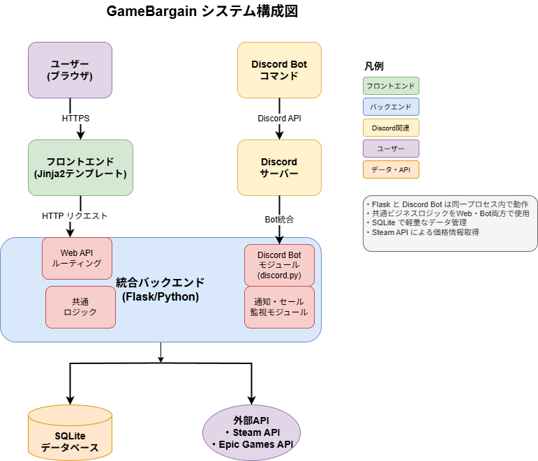
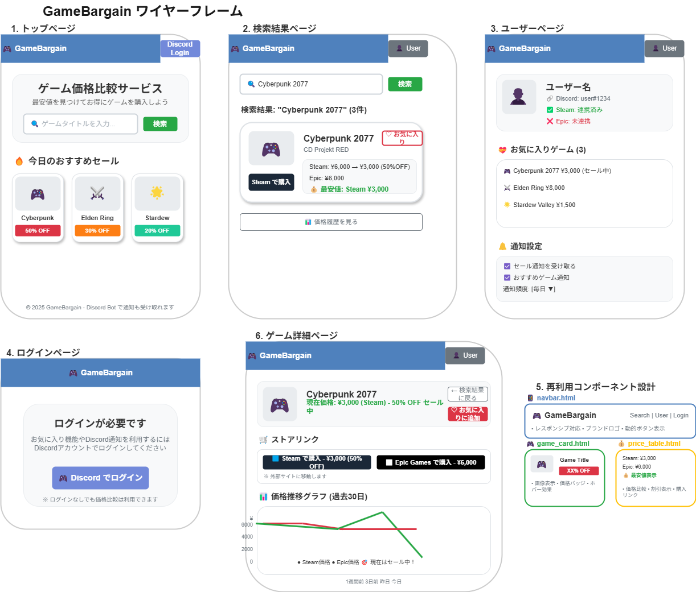

# GameBargain 基本設計書

## 目次
1. [システム構成設計](#1-システム構成設計)
2. [機能設計](#2-機能設計)
3. [画面設計](#3-画面設計)
4. [データ設計](#4-データ設計)
5. [API設計](#5-api設計)
6. [セキュリティ設計](#6-セキュリティ設計)

---

## 1. システム構成設計

### 1.1 システム全体構成図


### 1.2 技術スタック
| 分類 | 技術 | 理由 |
|------|------|------|
| フロントエンド | Jinja2 + Bootstrap 5 | サーバーサイドレンダリング、開発効率良 |
| JavaScript | Vanilla JS（最小限） | 軽量、学習コスト低 |
| バックエンド | Flask + Discord.py | Python統一、軽量 |
| データベース | SQLite | ファイルベース、運用コスト低 |
| 認証 | Discord OAuth2 | 標準的なセキュリティ |
| デプロイ | 自宅鯖/学科サーバー | コスト削減 |

### 1.3 プロジェクト構成
```
gamebargain/
├── app.py                      # メインアプリケーション
├── config.py                   # 設定ファイル
├── requirements.txt            # 依存関係
├── discord_bot/                # Discord Bot モジュール
│   ├── __init__.py
│   ├── bot.py                  # Bot実装
│   └── commands.py             # コマンド定義
├── web/                        # Web関連
│   ├── routes.py               # Flaskルート
│   ├── auth.py                 # 認証処理
│   └── forms.py                # フォーム処理
├── services/                   # 共通ビジネスロジック
│   ├── game_service.py         # ゲーム検索・価格比較
│   ├── price_service.py        # 価格監視・更新
│   └── notification_service.py # 通知処理
├── models/                     # データモデル
│   ├── __init__.py
│   ├── user.py                 # ユーザーモデル
│   ├── game.py                 # ゲームモデル
│   └── price.py                # 価格モデル
├── templates/                  # Jinja2テンプレート
│   ├── base.html               # ベーステンプレート
│   ├── components/             # 再利用コンポーネント
│   │   ├── navbar.html         # ナビゲーションバー
│   │   ├── game_card.html      # ゲームカード
│   │   └── price_table.html    # 価格テーブル
│   ├── index.html              # トップページ
│   ├── search.html             # 検索結果
│   ├── user.html               # ユーザーページ
│   ├── login.html              # ログインページ
│   └── game_detail.html        # ゲーム詳細ページ
├── static/                     # 静的ファイル
│   ├── css/
│   ├── js/
│   └── images/
└── data/
    └── gamebargain.db          # SQLiteデータベース
```

### 1.4 Discord Bot 統合設計

#### 統合のメリット
- **コード共有**: 価格比較ロジックをWeb・Bot両方で使用
- **データベース統一**: 同一SQLiteインスタンス使用
- **リアルタイム通知**: 価格変動時に即座にDiscord通知
- **運用効率**: 単一プロセス・単一デプロイで管理

#### 統合実装例
```python
# app.py
from flask import Flask
from discord_bot import create_bot
import threading

def create_app():
    app = Flask(__name__)
    
    # Web routes
    from web.routes import register_routes
    register_routes(app)
    
    # Discord Bot (別スレッド)
    bot = create_bot()
    bot_thread = threading.Thread(target=bot.run, args=[DISCORD_TOKEN])
    bot_thread.daemon = True
    bot_thread.start()
    
    return app
```

---

## 2. 機能設計

### 2.1 MVP機能一覧
| 機能ID | 機能名 | 優先度 | 工数 | 説明 |
|--------|---------|---------|------|------|
| F001 | ゲーム検索 | 最高 | 3日 | Steam APIでゲーム検索 |
| F002 | 価格比較 | 最高 | 4日 | 複数ストアの価格比較・最安値表示 |
| F003 | Discord認証 | 高 | 3日 | OAuth2によるログイン |
| F004 | お気に入り | 中 | 2日 | ゲームのお気に入り登録 |
| F005 | Discord Bot | 中 | 4日 | 基本的なBot機能 |
| F006 | 価格監視 | 中 | 3日 | 価格変動監視・通知 |

### 2.2 主要機能設計

#### F001: ゲーム検索機能
```python
def search_games(title):
    # 1. 入力値検証
    if not title or len(title) < 2:
        return {"error": "検索文字は2文字以上入力してください"}
    
    # 2. Steam API検索
    steam_results = steam_api.search_games(title)
    
    # 3. 価格情報付与
    for game in steam_results:
        game['prices'] = get_current_prices(game['id'])
    
    return steam_results
```

#### F002: 価格比較機能
```python
def compare_prices(game_id):
    # 1. ゲーム情報取得
    game = db.get_game(game_id)
    
    # 2. Steam価格取得
    steam_price = steam_api.get_price(game['steam_app_id'])
    
    # 3. 最安値判定
    best_deal = {
        "store": "steam",
        "price": steam_price,
        "discount": steam_price.get('discount', 0)
    }
    
    return {"game": game, "best_deal": best_deal}
```

#### F005: Discord Bot機能
```python
@bot.command(name='search')
async def search_command(ctx, *, title):
    results = search_games(title)  # 共通サービス使用
    embed = create_search_embed(results)
    await ctx.send(embed=embed)

@bot.command(name='favorite')
async def favorite_command(ctx, *, title):
    user_id = get_user_by_discord_id(ctx.author.id)
    game = find_game_by_title(title)
    add_to_favorites(user_id, game['id'])
    await ctx.send(f"✅ {title} をお気に入りに追加しました！")
```

---

## 3. 画面設計

### 3.1 主要画面一覧
1. **トップページ** - ゲーム検索フォーム、おすすめセール
2. **検索結果ページ** - 価格比較結果、購入リンク
3. **ユーザーページ** - お気に入り、通知設定
4. **ログインページ** - Discord OAuth認証
5. **ゲーム詳細ページ** - 価格推移グラフ、ストアリンク、変動履歴

### 3.2 ワイヤーフレーム詳細設計


モダンなデザインシステムと再利用コンポーネントを活用した全画面のワイヤーフレームは上記を参照。

### 3.3 画面構成（簡略版）

#### トップページ
```
┌─────────────────────────────────────────┐
│ GameBargain                    [ログイン] │
├─────────────────────────────────────────┤
│        ゲーム価格比較サービス              │
│  ┌─────────────────┐ [検索]              │
│  │ ゲームタイトル    │                    │
│  └─────────────────┘                    │
│  今日のおすすめセール                      │
│  [ゲーム1 50%OFF] [ゲーム2 30%OFF]       │
└─────────────────────────────────────────┘
```

#### 検索結果ページ
```
┌─────────────────────────────────────────┐
│ 検索結果: "Cyberpunk 2077"               │
│ ┌─────────────────────────────────────┐ │
│ │ Cyberpunk 2077           [♡お気に入り] │ │
│ │ 最安値: Steam ¥3,000                │ │
│ │ [Steamで購入] [�詳細を見る]         │ │
│ └─────────────────────────────────────┘ │
└─────────────────────────────────────────┘
```

#### ゲーム詳細ページ
```
┌─────────────────────────────────────────┐
│ 🎮 Cyberpunk 2077            [← 戻る]   │
│ 現在価格: ¥3,000 (Steam) - 50% OFF     │
│                        [♡お気に入り追加] │
├─────────────────────────────────────────┤
│ 🛒 ストアリンク                         │
│ [🟦 Steam - ¥3,000 (50%OFF)]           │
│ [⬜ Epic Games - ¥6,000]                │
├─────────────────────────────────────────┤
│ 📊 価格推移グラフ (過去30日)            │
│ [グラフ表示エリア]                      │
│ 📋 価格変動履歴                         │
└─────────────────────────────────────────┘
```

### 3.4 再利用コンポーネント設計
- **navbar.html** - ブランドロゴ、レスポンシブ対応、動的ボタン表示
- **game_card.html** - 画像、タイトル、価格バッジ、ホバー効果
- **price_table.html** - 価格比較、割引表示、購入リンク

---

## 4. データ設計

### 4.1 テーブル設計（MVP版）

#### usersテーブル
```sql
CREATE TABLE users (
    user_id INTEGER PRIMARY KEY AUTOINCREMENT,
    discord_id VARCHAR(20) UNIQUE NOT NULL,
    username VARCHAR(100) NOT NULL,
    avatar_url VARCHAR(255),
    created_at TIMESTAMP DEFAULT CURRENT_TIMESTAMP
);
```

#### gamesテーブル
```sql
CREATE TABLE games (
    game_id INTEGER PRIMARY KEY AUTOINCREMENT,
    title VARCHAR(200) NOT NULL,
    developer VARCHAR(100),
    steam_app_id VARCHAR(20) UNIQUE,
    image_url VARCHAR(255),
    created_at TIMESTAMP DEFAULT CURRENT_TIMESTAMP
);
```

#### pricesテーブル
```sql
CREATE TABLE prices (
    price_id INTEGER PRIMARY KEY AUTOINCREMENT,
    game_id INTEGER NOT NULL,
    store VARCHAR(20) NOT NULL DEFAULT 'steam',
    regular_price DECIMAL(10,2),
    sale_price DECIMAL(10,2),
    discount_rate INTEGER DEFAULT 0,
    is_on_sale BOOLEAN DEFAULT FALSE,
    created_at TIMESTAMP DEFAULT CURRENT_TIMESTAMP,
    FOREIGN KEY (game_id) REFERENCES games(game_id)
);
```

#### user_favoritesテーブル
```sql
CREATE TABLE user_favorites (
    favorite_id INTEGER PRIMARY KEY AUTOINCREMENT,
    user_id INTEGER NOT NULL,
    game_id INTEGER NOT NULL,
    created_at TIMESTAMP DEFAULT CURRENT_TIMESTAMP,
    FOREIGN KEY (user_id) REFERENCES users(user_id),
    FOREIGN KEY (game_id) REFERENCES games(game_id)
);
```

---

## 5. API設計

### 5.1 Web API エンドポイント
```
GET  /                      # トップページ
GET  /search?q={title}      # 検索結果ページ
GET  /game/{id}             # ゲーム詳細ページ（価格推移・ストアリンク含む）
GET  /user                  # ユーザーページ
POST /user/favorites        # お気に入り追加
GET  /auth/discord          # Discord認証
GET  /auth/callback         # 認証コールバック
```

### 5.2 Discord Bot コマンド
```
!gb search <title>          # ゲーム検索
!gb price <title>           # 価格確認
!gb favorite <title>        # お気に入り追加
!gb help                    # ヘルプ表示
```

### 5.3 外部API統合

#### Steam Storefront API
```python
# Steam API クライアント
class SteamAPI:
    BASE_URL = "https://store.steampowered.com/api"
    SEARCH_URL = "https://store.steampowered.com/search/suggest"
    
    def __init__(self):
        self.session = requests.Session()
        # レート制限: 1秒あたり最大10リクエスト
        self.rate_limiter = RateLimiter(max_calls=10, period=1)
    
    def search_games(self, query):
        """ゲーム検索"""
        params = {
            'term': query,
            'f': 'games',
            'cc': 'JP'  # 日本円価格
        }
        response = self.session.get(self.SEARCH_URL, params=params)
        return self._parse_search_results(response.json())
    
    def get_game_details(self, app_id):
        """ゲーム詳細・価格取得"""
        url = f"{self.BASE_URL}/appdetails"
        params = {
            'appids': app_id,
            'cc': 'JP',  # 日本円
            'l': 'japanese'  # 日本語
        }
        
        with self.rate_limiter:
            response = self.session.get(url, params=params)
            data = response.json()
            
        if str(app_id) in data and data[str(app_id)]['success']:
            return self._parse_game_data(data[str(app_id)]['data'])
        return None
    
    def _parse_game_data(self, data):
        """Steam APIレスポンスを解析"""
        price_info = data.get('price_overview', {})
        return {
            'title': data.get('name'),
            'developer': data.get('developers', []),
            'image_url': data.get('header_image'),
            'steam_app_id': data.get('steam_appid'),
            'regular_price': price_info.get('initial', 0) / 100,  # セント→円
            'sale_price': price_info.get('final', 0) / 100,
            'discount_rate': price_info.get('discount_percent', 0),
            'is_on_sale': price_info.get('discount_percent', 0) > 0,
            'store': 'steam'
        }
```

#### Epic Games 非公式API
```python
# Epic Games API クライアント
class EpicGamesAPI:
    BASE_URL = "https://store-site-backend-static.ak.epicgames.com"
    GRAPHQL_URL = "https://graphql.epicgames.com/graphql"
    
    def __init__(self):
        self.session = requests.Session()
        self.session.headers.update({
            'User-Agent': 'Mozilla/5.0 (Windows NT 10.0; Win64; x64) AppleWebKit/537.36'
        })
    
    def get_free_games_promotions(self):
        """無料ゲーム・プロモーション情報取得"""
        url = f"{self.BASE_URL}/freeGamesPromotions"
        params = {'locale': 'ja', 'country': 'JP'}
        
        try:
            response = self.session.get(url, params=params)
            data = response.json()
            return self._parse_promotions(data)
        except Exception as e:
            logger.error(f"Epic Games API error: {e}")
            return []
    
    def search_games(self, query):
        """ゲーム検索（GraphQL）"""
        # 注意: 非公式APIのため、構造が変更される可能性あり
        graphql_query = {
            "query": """
            query searchStoreQuery($query: String!, $locale: String!, $country: String!) {
                Catalog {
                    searchStore(query: $query, locale: $locale, country: $country) {
                        elements {
                            title
                            id
                            namespace
                            description
                            keyImages {
                                type
                                url
                            }
                            price(country: $country) {
                                totalPrice {
                                    discountPrice
                                    originalPrice
                                    currencyCode
                                }
                            }
                        }
                    }
                }
            }""",
            "variables": {
                "query": query,
                "locale": "ja-JP",
                "country": "JP"
            }
        }
        
        try:
            response = self.session.post(self.GRAPHQL_URL, json=graphql_query)
            return self._parse_search_results(response.json())
        except Exception as e:
            logger.error(f"Epic GraphQL error: {e}")
            return []
    
    def _parse_promotions(self, data):
        """プロモーションデータを解析"""
        games = []
        for element in data.get('data', {}).get('Catalog', {}).get('searchStore', {}).get('elements', []):
            price = element.get('price', {}).get('totalPrice', {})
            games.append({
                'title': element.get('title'),
                'epic_id': element.get('id'),
                'image_url': self._get_image_url(element.get('keyImages', [])),
                'regular_price': price.get('originalPrice', 0) / 100,
                'sale_price': price.get('discountPrice', 0) / 100,
                'discount_rate': self._calculate_discount(price),
                'is_on_sale': price.get('discountPrice', 0) < price.get('originalPrice', 0),
                'store': 'epic'
            })
        return games
```

#### API統合サービス
```python
class PriceComparisonService:
    def __init__(self):
        self.steam_api = SteamAPI()
        self.epic_api = EpicGamesAPI()
    
    async def search_all_stores(self, query):
        """全ストアでゲーム検索"""
        results = {
            'steam': [],
            'epic': [],
            'merged': []
        }
        
        # 並行実行で高速化
        steam_task = asyncio.create_task(self.steam_api.search_games(query))
        epic_task = asyncio.create_task(self.epic_api.search_games(query))
        
        results['steam'] = await steam_task
        results['epic'] = await epic_task
        results['merged'] = self._merge_results(results['steam'], results['epic'])
        
        return results
    
    def _merge_results(self, steam_games, epic_games):
        """タイトルマッチングで結果をマージ"""
        merged = []
        for steam_game in steam_games:
            # Epic Gamesで同じタイトルを検索
            epic_match = self._find_matching_game(steam_game['title'], epic_games)
            
            game_data = steam_game.copy()
            if epic_match:
                game_data['epic_price'] = epic_match
                game_data['best_price'] = min(
                    steam_game.get('sale_price', float('inf')),
                    epic_match.get('sale_price', float('inf'))
                )
            
            merged.append(game_data)
        
        return merged
```

#### エラーハンドリング・レート制限
```python
# レート制限クラス
class RateLimiter:
    def __init__(self, max_calls, period):
        self.max_calls = max_calls
        self.period = period
        self.calls = []
    
    def __enter__(self):
        now = time.time()
        # 古いコールを削除
        self.calls = [call_time for call_time in self.calls 
                     if now - call_time < self.period]
        
        if len(self.calls) >= self.max_calls:
            sleep_time = self.period - (now - self.calls[0])
            if sleep_time > 0:
                time.sleep(sleep_time)
        
        self.calls.append(now)
    
    def __exit__(self, *args):
        pass

# エラーハンドリング
@retry(stop=stop_after_attempt(3), wait=wait_exponential(multiplier=1, min=4, max=10))
def api_call_with_retry(func, *args, **kwargs):
    """APIコール用のリトライデコレータ"""
    try:
        return func(*args, **kwargs)
    except requests.exceptions.RequestException as e:
        logger.warning(f"API call failed, retrying: {e}")
        raise
    except Exception as e:
        logger.error(f"Unexpected error in API call: {e}")
        raise
```

#### 注意事項
- **Steam API**: 公式APIのため安定、ただしレート制限あり
- **Epic Games API**: 非公式のため構造変更リスク、エラーハンドリング重要
- **価格取得頻度**: 1日1-2回程度に制限し、サーバー負荷を軽減
- **キャッシュ戦略**: 価格情報は1時間キャッシュ、ゲーム情報は24時間キャッシュ

---

## 6. セキュリティ設計

### 6.1 基本セキュリティ対策
- **Discord OAuth2**: 安全なユーザー認証
- **CSRF対策**: Flask-WTF使用
- **SQL Injection対策**: パラメータ化クエリ
- **XSS対策**: Jinja2の自動エスケープ
- **環境変数**: 機密情報の適切な管理

### 6.2 API制限
- **レート制限**: Steam API呼び出し頻度制限
- **エラーハンドリング**: 適切なエラーレスポンス
- **ログ監視**: 異常なアクセスパターンの検知

---

## 7. 開発・運用

### 7.1 開発環境
```bash
# 依存関係インストール
pip install flask discord.py requests python-dotenv

# 環境変数設定
DISCORD_CLIENT_ID=your_client_id
DISCORD_CLIENT_SECRET=your_client_secret
DISCORD_BOT_TOKEN=your_bot_token
STEAM_API_KEY=your_steam_api_key
```

### 7.2 デプロイ・運用
- **単一プロセス**: Flask + Discord Bot統合実行
- **データベース**: SQLiteファイルベース
- **ログ**: 標準出力 + ファイル出力
- **監視**: プロセス死活監視のみ

### 7.3 管理・メンテナンス
```bash
# ログ確認
tail -f logs/gamebargain.log

# データベース直接操作
sqlite3 data/gamebargain.db
> SELECT * FROM users;
> SELECT * FROM prices WHERE created_at > datetime('now', '-1 day');

# 価格同期の手動実行
python -c "from services.price_service import sync_all_prices; sync_all_prices()"

# バックアップ
cp data/gamebargain.db backups/gamebargain_$(date +%Y%m%d).db
```

**管理画面を削除した理由**:
- ゲーム情報は Steam API から自動取得
- ユーザー管理は Discord OAuth で自動化
- システム管理はコマンドライン・DBクライアントで十分
- MVPに集中し、開発工数を削減

---

