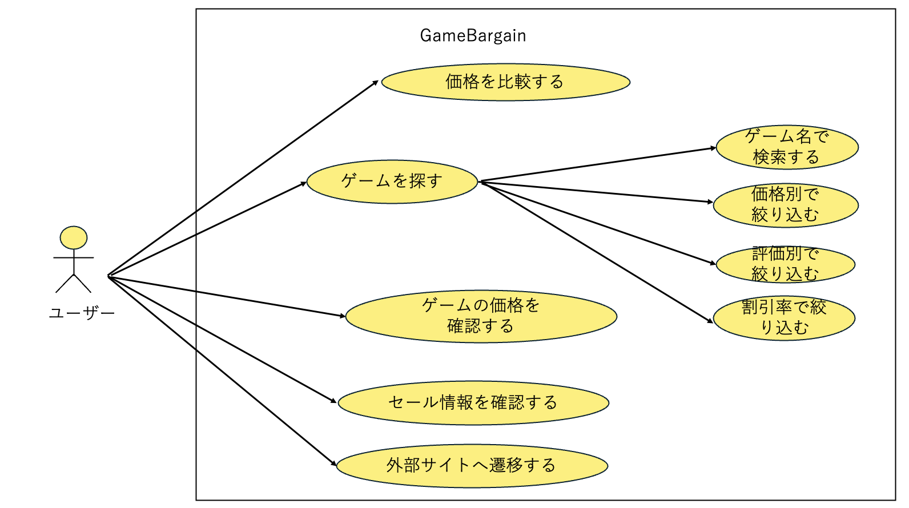

# 要件定義
## 目次
1. 目的
1. ユースケース
1. 機能要件
- ゲーム価格比較機能
    - ゲーム検索
    - 価格表示
    - ストアリンク
- おすすめゲーム表示
- Discord bot機能
    - おすすめゲームの通知
- ユーザーインターフェース
    - レスポンシブデザイン
    - ユーザーフレンドリーなナビゲーション
- 画面遷移図
1. 非機能要件
- インフラ
- ユーザビリティ

## 目的
　現在、ゲームを購入する際に、どのストアで購入するのが最も安いかを調べるのは手間がかかる。これを自動化してまとめることで、ユーザーが簡単に最安値を見つけることができるようにする。また、セール情報やおすすめゲームの通知機能を提供することで、ユーザーのゲーム購入体験を向上させる。
- 特に学生やお金がない人にとって、ゲームを安く購入することは重要な要素であるため、このサイトはそのニーズに応えることを目的とする。

## ユースケース

## 機能要件
### ゲーム価格比較機能
- ユーザーがゲームのタイトルを入力すると、ゲーム販売サイトから価格を比較し、最も安い購入先を表示する。
- 以下の主要ゲーム販売サイトから価格を取得する。
  - Steam
  - Epic Games
- 検索結果は、ゲームのタイトル、通常価格、セール価格、ストアリンクを含み、価格はリアルタイムで更新され、最新の情報を提供する。

### おすすめゲーム表示
- ユーザーが今買うべきゲームを表示する機能を提供する。
- おすすめゲームは、セール情報や人気のゲームを基に表示される

### Discord bot機能
- botをユーザーのDiscordサーバーに追加することで、ゲームのおすすめ情報を通知する。
- お気に入りのゲームのセール情報を通知する機能を提供する。

### ユーザーインターフェース
- レスポンシブデザインを採用し、PCやスマートフォンなど、様々なデバイスで快適に利用できるようにする。
- 多くの情報を表示でき、ユーザーフレンドリーなナビゲーションを提供する。

## 非機能要件
### インフラ
- 自宅鯖か学科サーバーを使用して、お金を使わないで運用する。
### ユーザビリティ
- ゲーマーが使いやすくDisocrdやsteam、epicとの連携を意識する
