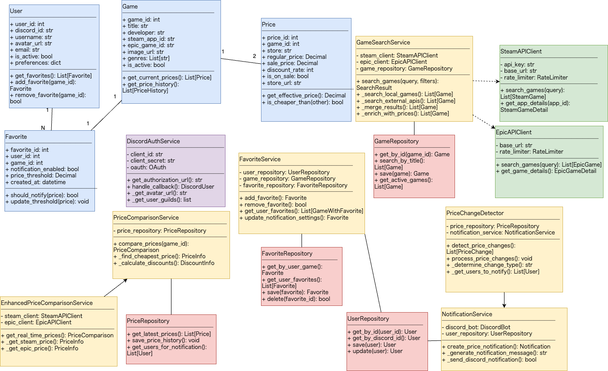
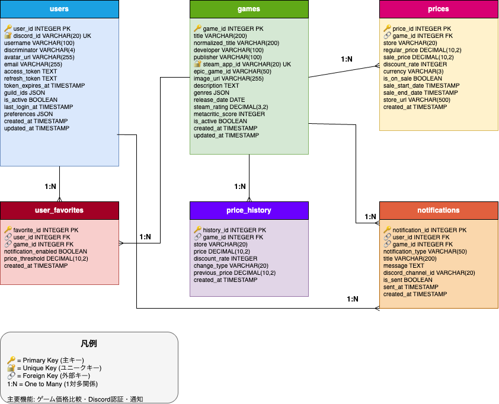
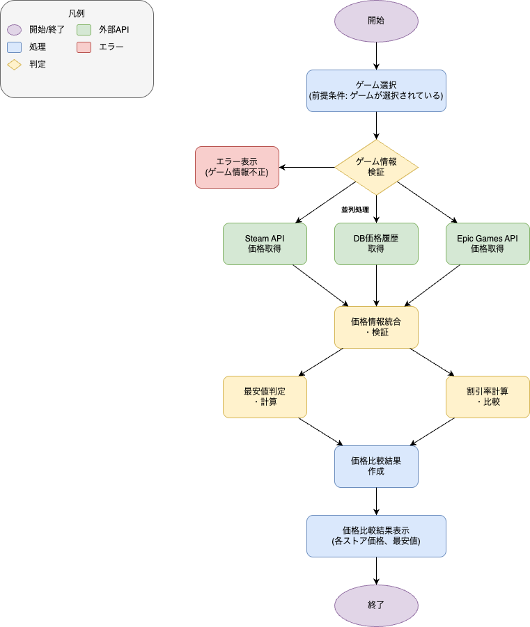

# GameBargain 詳細設計書

## 目次
- [GameBargain 詳細設計書](#gamebargain-詳細設計書)
  - [目次](#目次)
  - [1. 概要](#1-概要)
    - [1.1 設計方針](#11-設計方針)
    - [1.2 技術仕様詳細](#12-技術仕様詳細)
    - [1.3 パフォーマンス要件](#13-パフォーマンス要件)
    - [1.4 開発期間](#14-開発期間)
      - [開発スケジュール](#開発スケジュール)
  - [2. アーキテクチャ設計](#2-アーキテクチャ設計)
    - [2.1 レイヤー構成](#21-レイヤー構成)
    - [2.2 モジュール依存関係](#22-モジュール依存関係)
    - [2.3 クラス図](#23-クラス図)
      - [2.3.1 主要クラス構成](#231-主要クラス構成)
      - [2.3.2 クラス間の主要関係](#232-クラス間の主要関係)
      - [2.3.3 アーキテクチャパターン](#233-アーキテクチャパターン)
  - [3. データベース詳細設計](#3-データベース詳細設計)
    - [3.1 テーブル構成概要](#31-テーブル構成概要)
    - [3.2 ER図](#32-er図)
    - [3.3 テーブル詳細設計](#33-テーブル詳細設計)
      - [3.3.1 usersテーブル](#331-usersテーブル)
      - [3.3.2 gamesテーブル](#332-gamesテーブル)
      - [3.3.3 pricesテーブル (1:N関係)](#333-pricesテーブル-1n関係)
      - [3.3.4 user\_favoritesテーブル](#334-user_favoritesテーブル)
      - [3.3.5 price\_historyテーブル](#335-price_historyテーブル)
      - [3.3.6 notificationsテーブル](#336-notificationsテーブル)
      - [3.3.7 user\_settingsテーブル](#337-user_settingsテーブル)
      - [3.3.8 discord\_settingsテーブル](#338-discord_settingsテーブル)
      - [3.3.9 system\_logsテーブル](#339-system_logsテーブル)
    - [3.4 データベース設定](#34-データベース設定)
  - [4. クラス設計詳細](#4-クラス設計詳細)
    - [4.1 サービス層クラス](#41-サービス層クラス)
      - [4.1.1 GameSearchService クラス](#411-gamesearchservice-クラス)
      - [4.1.2 PriceComparisonService クラス](#412-pricecomparisonservice-クラス)
      - [4.1.3 EnhancedPriceComparisonService クラス](#413-enhancedpricecomparisonservice-クラス)
      - [4.1.4 FavoriteService クラス](#414-favoriteservice-クラス)
      - [4.1.5 NotificationService クラス](#415-notificationservice-クラス)
      - [4.1.6 PriceChangeDetector クラス](#416-pricechangedetector-クラス)
      - [4.1.3 UserService クラス](#413-userservice-クラス)
      - [4.1.4 FavoriteService クラス](#414-favoriteservice-クラス-1)
      - [4.1.5 NotificationService クラス](#415-notificationservice-クラス-1)
    - [4.2 リポジトリ層クラス](#42-リポジトリ層クラス)
      - [4.2.1 BaseRepository クラス](#421-baserepository-クラス)
      - [4.2.2 GameRepository クラス](#422-gamerepository-クラス)
    - [4.3 外部API クライアント](#43-外部api-クライアント)
      - [4.3.1 BaseAPIClient クラス](#431-baseapiclient-クラス)
      - [4.3.2 SteamAPIClient クラス](#432-steamapiclient-クラス)
    - [4.4 データモデル](#44-データモデル)
      - [4.4.1 User モデル](#441-user-モデル)
      - [4.4.2 Game モデル](#442-game-モデル)
    - [4.5 Discord Bot クラス](#45-discord-bot-クラス)
      - [4.5.1 DiscordBot クラス](#451-discordbot-クラス)
    - [4.6 ユーティリティクラス](#46-ユーティリティクラス)
      - [4.6.1 RateLimiter クラス](#461-ratelimiter-クラス)
  - [5. API詳細設計](#5-api詳細設計)
    - [4.1 RESTful API エンドポイント](#41-restful-api-エンドポイント)
      - [4.1.1 ゲーム関連API](#411-ゲーム関連api)
      - [4.1.2 ユーザー関連API](#412-ユーザー関連api)
    - [4.2 APIレスポンス型定義](#42-apiレスポンス型定義)
      - [4.2.1 共通レスポンス型](#421-共通レスポンス型)
      - [4.2.2 ゲーム関連レスポンス型](#422-ゲーム関連レスポンス型)
  - [6. 機能詳細設計](#6-機能詳細設計)
    - [6.1 F001: ゲーム検索機能](#61-f001-ゲーム検索機能)
      - [6.1.1 処理フロー](#611-処理フロー)
      - [6.1.2 クラス設計](#612-クラス設計)
      - [5.1.3 入力値検証](#513-入力値検証)
      - [5.1.4 外部API クライアント実装](#514-外部api-クライアント実装)
      - [5.1.3 入力値検証](#513-入力値検証-1)
      - [5.1.4 外部API クライアント実装](#514-外部api-クライアント実装-1)
    - [6.2 F002: 価格比較機能](#62-f002-価格比較機能)
      - [6.2.1 処理フロー](#621-処理フロー)
      - [6.2.2 価格比較ロジック](#622-価格比較ロジック)
    - [6.3 F003: Discord認証機能](#63-f003-discord認証機能)
      - [6.3.1 OAuth2フロー](#631-oauth2フロー)
      - [6.3.2 認証処理実装](#632-認証処理実装)
    - [6.4 F004: お気に入り機能](#64-f004-お気に入り機能)
      - [6.4.1 機能概要](#641-機能概要)
      - [6.4.2 クラス設計](#642-クラス設計)
    - [6.5 F006: 価格監視機能](#65-f006-価格監視機能)
      - [6.5.1 機能概要](#651-機能概要)
      - [6.5.2 価格変動検知ロジック](#652-価格変動検知ロジック)
      - [6.5.3 バッチスケジュール設計](#653-バッチスケジュール設計)
    - [6.6 通知システム設計](#66-通知システム設計)
      - [6.6.1 通知サービス](#661-通知サービス)
  - [11. 実装計画・優先度](#11-実装計画優先度)
    - [11.1 開発フェーズ](#111-開発フェーズ)
      - [Phase 1: 基盤機能 (1週間)](#phase-1-基盤機能-1週間)
      - [Phase 2: ユーザー機能 (1週間)](#phase-2-ユーザー機能-1週間)
      - [Phase 3: Discord Bot (1週間)](#phase-3-discord-bot-1週間)
      - [Phase 4: 価格監視・通知 (1週間)](#phase-4-価格監視通知-1週間)
    - [11.2 技術的課題と対策](#112-技術的課題と対策)
      - [高優先度課題](#高優先度課題)
      - [中優先度課題](#中優先度課題)
    - [11.3 運用・保守計画](#113-運用保守計画)
      - [定期メンテナンス](#定期メンテナンス)
      - [監視項目](#監視項目)
      - [障害対応](#障害対応)
    - [11.4 今後の拡張性](#114-今後の拡張性)
      - [短期的拡張 (3-6ヶ月)](#短期的拡張-3-6ヶ月)
      - [中期的拡張 (6-12ヶ月)](#中期的拡張-6-12ヶ月)
      - [長期的展望 (1年以上)](#長期的展望-1年以上)
  - [12. 技術仕様詳細](#12-技術仕様詳細-1)
    - [12.1 環境変数設定](#121-環境変数設定)
    - [12.2 依存関係 (requirements.txt)](#122-依存関係-requirementstxt)
    - [12.3 Docker設定](#123-docker設定)

---

## 1. 概要

### 1.1 設計方針
- **単一責任原則**: 各クラス・モジュールは明確な責任を持つ
- **依存性注入**: テスタビリティと保守性を向上
- **レイヤードアーキテクチャ**: プレゼンテーション、ビジネス、データアクセスの分離
- **非同期処理**: Discord Bot、価格監視バッチの非同期実行

### 1.2 技術仕様詳細
| 項目 | 技術 | バージョン | 用途 |
|------|------|-----------|------|
| Python | 3.9+ | - | メイン言語 |
| Flask | 2.3+ | - | Webフレームワーク |
| Discord.py | 2.3+ | - | Discord Bot |
| SQLAlchemy | 2.0+ | - | ORM |
| Alembic | 1.11+ | - | DBマイグレーション |
| Flask-WTF | 1.1+ | - | フォーム・CSRF対策 |
| Requests | 2.31+ | - | HTTP クライアント |
| APScheduler | 3.10+ | - | スケジューラ |
| Authlib | 1.2+ | - | OAuth2クライアント |

### 1.3 パフォーマンス要件
| 項目 | 目標値 | 備考 |
|------|--------|------|
| 同時接続ユーザー数 | 100人 | 想定最大値 |
| API応答時間 | 95%ile 2秒以下 | 外部API依存を除く |
| DB接続プール | 10-20接続 | SQLAlchemy設定 |
| セッション有効期限 | 30日 | Discord認証標準 |
| キャッシュTTL | 5-60分 | データ種別により調整 |

### 1.4 開発期間
- **期間**: 1ヶ月
- **フェーズ**: 以下のスケジュールに基づいて進行

#### 開発スケジュール
| フェーズ | 期間 | 内容 |
|----------|------|------|
| Phase 1 | 1週間 | 基盤機能の実装 |
| Phase 2 | 1週間 | ユーザー機能の実装 |
| Phase 3 | 1週間 | Discord Botの開発 |
| Phase 4 | 1週間 | 価格監視・通知機能の実装 |

---

## 2. アーキテクチャ設計

### 2.1 レイヤー構成
```
┌─────────────────────────────────────┐
│ Presentation Layer (Web UI)         │
│ - Flask Routes                      │
│ - Jinja2 Templates                  │
│ - Static Files                      │
├─────────────────────────────────────┤
│ Application Layer                   │
│ - Web Controllers                   │
│ - Discord Bot Commands              │
│ - API Endpoints                     │
├─────────────────────────────────────┤
│ Domain/Service Layer                │
│ - Game Service                      │
│ - Price Service                     │
│ - User Service                      │
│ - Notification Service              │
├─────────────────────────────────────┤
│ Infrastructure Layer                │
│ - External API Clients              │
│ - Database Access                   │
│ - Authentication                    │
└─────────────────────────────────────┘
```

### 2.2 モジュール依存関係


### 2.3 クラス図


#### 2.3.1 主要クラス構成

**データモデル (青色):**
- **User**: ユーザーエンティティ - Discord認証情報、プリファレンス
- **Game**: ゲームエンティティ - Steam/Epic Game ID、メタデータ
- **Price**: 価格エンティティ - 現在価格、セール情報
- **Favorite**: お気に入りエンティティ - 通知設定、価格閾値

**サービス層 (黄色):**
- **GameSearchService**: ゲーム検索・外部API統合
- **PriceComparisonService**: 価格比較・分析
- **EnhancedPriceComparisonService**: リアルタイム価格取得 (継承)
- **FavoriteService**: お気に入り管理・通知設定
- **NotificationService**: 通知作成・Discord送信
- **PriceChangeDetector**: 価格変動検知・自動通知

**外部APIクライアント (緑色):**
- **SteamAPIClient**: Steam Web API連携・レート制限管理
- **EpicAPIClient**: Epic Games Store API連携

**リポジトリ層 (赤色):**
- **UserRepository**: ユーザーデータアクセス
- **GameRepository**: ゲームデータアクセス・検索
- **PriceRepository**: 価格データアクセス・履歴管理
- **FavoriteRepository**: お気に入りデータアクセス

**認証・Discord (紫色):**
- **DiscordAuthService**: OAuth2認証・ユーザー情報取得

#### 2.3.2 クラス間の主要関係

**集約・関連関係:**
- `User` → `Favorite` (1:N) - ユーザーは複数のお気に入りを持つ
- `Game` → `Price` (1:N) - ゲームは複数の価格情報を持つ
- `Game` ← `Favorite` (N:1) - お気に入りはゲームを参照

**依存関係:**
- `GameSearchService` → `SteamAPIClient`, `EpicAPIClient`, `GameRepository`
- `PriceComparisonService` → `PriceRepository`
- `EnhancedPriceComparisonService` → `SteamAPIClient`, `EpicAPIClient` (継承)
- `FavoriteService` → `UserRepository`, `GameRepository`, `FavoriteRepository`
- `NotificationService` → `UserRepository`
- `PriceChangeDetector` → `PriceRepository`, `NotificationService`

**継承関係:**
- `EnhancedPriceComparisonService` extends `PriceComparisonService`

#### 2.3.3 アーキテクチャパターン

**レイヤードアーキテクチャ:**
1. **プレゼンテーション層**: FastAPI エンドポイント
2. **サービス層**: ビジネスロジック (Service classes)
3. **リポジトリ層**: データアクセス抽象化 (Repository classes)
4. **インフラ層**: 外部API・Discord Bot

**ドメイン駆動設計 (DDD) 要素:**
- **エンティティ**: User, Game, Price, Favorite
- **サービス**: ゲーム検索、価格比較、通知処理
- **リポジトリ**: データアクセスの抽象化

---

## 3. データベース詳細設計

### 3.1 テーブル構成概要
**主要テーブル:**
1. **users** - ユーザー情報・Discord認証管理
2. **games** - ゲーム基本情報・メタデータ
3. **prices** - 現在価格情報（最新価格のみ）
4. **price_history** - 価格変動履歴（時系列データ）
5. **user_favorites** - お気に入りゲーム管理
6. **notifications** - 通知履歴・ステータス管理
7. **user_settings** - ユーザー個別設定
8. **discord_settings** - Discord bot設定・チャンネル管理
9. **system_logs** - システムログ・監視データ

### 3.2 ER図


### 3.3 テーブル詳細設計

#### 3.3.1 usersテーブル
```sql
CREATE TABLE users (
    user_id INTEGER PRIMARY KEY AUTOINCREMENT,
    discord_id VARCHAR(20) UNIQUE NOT NULL,
    username VARCHAR(100) NOT NULL,
    discriminator VARCHAR(4), -- Discord#0000形式のタグ
    avatar_url VARCHAR(255),
    email VARCHAR(255), -- Discord OAuth scope: email
    access_token TEXT, -- Discord OAuth token (暗号化)
    refresh_token TEXT, -- Discord refresh token (暗号化)
    token_expires_at TIMESTAMP,
    guild_ids JSON, -- 参加サーバーID配列
    is_active BOOLEAN DEFAULT TRUE,
    last_login_at TIMESTAMP,
    preferences JSON, -- ユーザー設定 (通知設定等)
    created_at TIMESTAMP DEFAULT CURRENT_TIMESTAMP,
    updated_at TIMESTAMP DEFAULT CURRENT_TIMESTAMP
);

-- インデックス
CREATE INDEX idx_users_discord_id ON users(discord_id);
CREATE INDEX idx_users_is_active ON users(is_active);
CREATE INDEX idx_users_last_login ON users(last_login_at);
```

#### 3.3.2 gamesテーブル
```sql
CREATE TABLE games (
    game_id INTEGER PRIMARY KEY AUTOINCREMENT,
    title VARCHAR(200) NOT NULL,
    normalized_title VARCHAR(200) NOT NULL, -- 検索用正規化タイトル
    developer VARCHAR(100),
    publisher VARCHAR(100),
    steam_app_id VARCHAR(20) UNIQUE,
    epic_game_id VARCHAR(50),
    image_url VARCHAR(255),
    description TEXT,
    genres JSON, -- ジャンル配列
    release_date DATE,
    steam_rating DECIMAL(3,2), -- Steam評価 (0-100)
    metacritic_score INTEGER, -- Metacritic スコア
    is_active BOOLEAN DEFAULT TRUE,
    created_at TIMESTAMP DEFAULT CURRENT_TIMESTAMP,
    updated_at TIMESTAMP DEFAULT CURRENT_TIMESTAMP
);

-- インデックス
CREATE INDEX idx_games_normalized_title ON games(normalized_title);
CREATE INDEX idx_games_steam_app_id ON games(steam_app_id);
CREATE INDEX idx_games_is_active ON games(is_active);
CREATE UNIQUE INDEX idx_games_steam_epic ON games(steam_app_id, epic_game_id);
```

#### 3.3.3 pricesテーブル (1:N関係)
```sql
CREATE TABLE prices (
    price_id INTEGER PRIMARY KEY AUTOINCREMENT,
    game_id INTEGER NOT NULL,
    store VARCHAR(20) NOT NULL, -- 'steam', 'epic'
    regular_price DECIMAL(10,2),
    sale_price DECIMAL(10,2),
    discount_rate INTEGER DEFAULT 0, -- 割引率 (0-100)
    currency VARCHAR(3) DEFAULT 'JPY',
    is_on_sale BOOLEAN DEFAULT FALSE,
    sale_start_date TIMESTAMP,
    sale_end_date TIMESTAMP,
    store_url VARCHAR(500), -- 購入ページURL
    created_at TIMESTAMP DEFAULT CURRENT_TIMESTAMP,
    FOREIGN KEY (game_id) REFERENCES games(game_id) ON DELETE CASCADE
);

-- インデックス
CREATE INDEX idx_prices_game_store ON prices(game_id, store);
CREATE INDEX idx_prices_is_on_sale ON prices(is_on_sale);
CREATE INDEX idx_prices_created_at ON prices(created_at);

-- 【リレーション説明】
-- games (1) : prices (N) の関係
-- 1つのゲームに対して複数の価格情報が存在：
--
-- ◆ 現在価格（pricesテーブル）:
-- - 各ストアの「最新価格」のみを保持（最大2レコード/ゲーム）
-- - Steam: 最新の価格・セール情報
-- - Epic:  最新の価格・セール情報
-- 
-- ◆ 価格履歴（price_historyテーブル）:
-- - 価格変動の「履歴」を時系列で蓄積（多数レコード/ゲーム）
-- - 価格変動検知時に新規レコード追加
--
-- ◆ テーブル分離の理由:
-- - 頻繁アクセスする「現在価格」と、分析用の「履歴」を分離
-- - パフォーマンス向上（価格比較時は現在価格のみクエリ）
-- - データ量制御（現在価格は常に最新2レコードのみ）
```

#### 3.3.4 user_favoritesテーブル
```sql
CREATE TABLE user_favorites (
    favorite_id INTEGER PRIMARY KEY AUTOINCREMENT,
    user_id INTEGER NOT NULL,
    game_id INTEGER NOT NULL,
    notification_enabled BOOLEAN DEFAULT TRUE,
    price_threshold DECIMAL(10,2), -- 通知する価格閾値
    created_at TIMESTAMP DEFAULT CURRENT_TIMESTAMP,
    FOREIGN KEY (user_id) REFERENCES users(user_id) ON DELETE CASCADE,
    FOREIGN KEY (game_id) REFERENCES games(game_id) ON DELETE CASCADE,
    UNIQUE(user_id, game_id)
);

-- インデックス
CREATE INDEX idx_user_favorites_user_id ON user_favorites(user_id);
CREATE INDEX idx_user_favorites_notification ON user_favorites(notification_enabled);
```

#### 3.3.5 price_historyテーブル
```sql
CREATE TABLE price_history (
    history_id INTEGER PRIMARY KEY AUTOINCREMENT,
    game_id INTEGER NOT NULL,
    store VARCHAR(20) NOT NULL,
    price DECIMAL(10,2),
    discount_rate INTEGER DEFAULT 0,
    change_type VARCHAR(20), -- 'price_increase', 'price_decrease', 'sale_start', 'sale_end'
    previous_price DECIMAL(10,2),
    created_at TIMESTAMP DEFAULT CURRENT_TIMESTAMP,
    FOREIGN KEY (game_id) REFERENCES games(game_id) ON DELETE CASCADE
);

-- インデックス
CREATE INDEX idx_price_history_game_store ON price_history(game_id, store);
CREATE INDEX idx_price_history_created_at ON price_history(created_at);


```

#### 3.3.6 notificationsテーブル
```sql
CREATE TABLE notifications (
    notification_id INTEGER PRIMARY KEY AUTOINCREMENT,
    user_id INTEGER,
    game_id INTEGER,
    notification_type VARCHAR(50), -- 'price_drop', 'sale_start', 'sale_end', 'free_game'
    title VARCHAR(200),
    message TEXT,
    discord_channel_id VARCHAR(20),
    is_sent BOOLEAN DEFAULT FALSE,
    sent_at TIMESTAMP,
    created_at TIMESTAMP DEFAULT CURRENT_TIMESTAMP,
    FOREIGN KEY (user_id) REFERENCES users(user_id) ON DELETE SET NULL,
    FOREIGN KEY (game_id) REFERENCES games(game_id) ON DELETE SET NULL
);

-- インデックス
CREATE INDEX idx_notifications_user_id ON notifications(user_id);
CREATE INDEX idx_notifications_is_sent ON notifications(is_sent);
CREATE INDEX idx_notifications_created_at ON notifications(created_at);
```

#### 3.3.7 user_settingsテーブル
```sql
CREATE TABLE user_settings (
    setting_id INTEGER PRIMARY KEY AUTOINCREMENT,
    user_id INTEGER NOT NULL,
    notification_enabled BOOLEAN DEFAULT TRUE,
    notification_frequency VARCHAR(20) DEFAULT 'daily', -- 'realtime', 'daily', 'weekly'
    price_threshold DECIMAL(10,2), -- 通知する価格閾値（この価格以下でセール通知）
    preferred_currency VARCHAR(3) DEFAULT 'JPY',
    language VARCHAR(10) DEFAULT 'ja',
    timezone VARCHAR(50) DEFAULT 'Asia/Tokyo',
    email_notifications BOOLEAN DEFAULT FALSE,
    discord_notifications BOOLEAN DEFAULT TRUE,
    created_at TIMESTAMP DEFAULT CURRENT_TIMESTAMP,
    updated_at TIMESTAMP DEFAULT CURRENT_TIMESTAMP,
    FOREIGN KEY (user_id) REFERENCES users(user_id) ON DELETE CASCADE,
    UNIQUE(user_id)
);

-- インデックス
CREATE INDEX idx_user_settings_user_id ON user_settings(user_id);
CREATE INDEX idx_user_settings_notification_enabled ON user_settings(notification_enabled);
```

#### 3.3.8 discord_settingsテーブル
```sql
CREATE TABLE discord_settings (
    setting_id INTEGER PRIMARY KEY AUTOINCREMENT,
    user_id INTEGER NOT NULL,
    guild_id VARCHAR(20), -- Discordサーバー（ギルド）ID
    channel_id VARCHAR(20), -- 通知送信先チャンネルID
    bot_enabled BOOLEAN DEFAULT TRUE,
    notification_types JSON, -- 通知タイプ配列 ['price_drop', 'sale_start', 'free_game']
    notification_format VARCHAR(50) DEFAULT 'embed', -- 'embed', 'text'
    mention_role_id VARCHAR(20), -- メンション対象ロールID
    quiet_hours_start TIME, -- 静音時間開始
    quiet_hours_end TIME, -- 静音時間終了
    webhook_url VARCHAR(500), -- Discord Webhook URL (暗号化)
    created_at TIMESTAMP DEFAULT CURRENT_TIMESTAMP,
    updated_at TIMESTAMP DEFAULT CURRENT_TIMESTAMP,
    FOREIGN KEY (user_id) REFERENCES users(user_id) ON DELETE CASCADE
);

-- インデックス
CREATE INDEX idx_discord_settings_user_id ON discord_settings(user_id);
CREATE INDEX idx_discord_settings_guild_id ON discord_settings(guild_id);
CREATE INDEX idx_discord_settings_bot_enabled ON discord_settings(bot_enabled);
```

#### 3.3.9 system_logsテーブル
```sql
CREATE TABLE system_logs (
    log_id INTEGER PRIMARY KEY AUTOINCREMENT,
    log_level VARCHAR(10) NOT NULL, -- 'DEBUG', 'INFO', 'WARNING', 'ERROR', 'CRITICAL'
    module VARCHAR(50), -- 'api', 'bot', 'scraper', 'auth', 'scheduler'
    function_name VARCHAR(100),
    message TEXT NOT NULL,
    error_details TEXT, -- スタックトレース、エラー詳細
    user_id INTEGER,
    session_id VARCHAR(100),
    ip_address VARCHAR(45), -- IPv4/IPv6対応
    user_agent TEXT,
    request_path VARCHAR(500),
    execution_time DECIMAL(10,6), -- 実行時間（秒）
    memory_usage INTEGER, -- メモリ使用量（MB）
    api_endpoint VARCHAR(200),
    steam_api_calls INTEGER DEFAULT 0, -- Steam API呼び出し回数
    epic_api_calls INTEGER DEFAULT 0, -- Epic API呼び出し回数
    created_at TIMESTAMP DEFAULT CURRENT_TIMESTAMP,
    FOREIGN KEY (user_id) REFERENCES users(user_id) ON DELETE SET NULL
);

-- インデックス
CREATE INDEX idx_system_logs_log_level ON system_logs(log_level);
CREATE INDEX idx_system_logs_module ON system_logs(module);
CREATE INDEX idx_system_logs_created_at ON system_logs(created_at);
CREATE INDEX idx_system_logs_user_id ON system_logs(user_id);
CREATE INDEX idx_system_logs_api_endpoint ON system_logs(api_endpoint);

-- パーティション用インデックス（月次ログローテーション対応）
CREATE INDEX idx_system_logs_created_month ON system_logs(strftime('%Y-%m', created_at));
```

### 3.4 データベース設定
```python
# config.py
import os
from datetime import timedelta

class Config:
    # Database
    SQLALCHEMY_DATABASE_URI = os.environ.get('DATABASE_URL') or 'sqlite:///data/gamebargain.db'
    SQLALCHEMY_TRACK_MODIFICATIONS = False
    SQLALCHEMY_ENGINE_OPTIONS = {
        'pool_size': 10,
        'pool_recycle': 3600,
        'pool_pre_ping': True,
        'max_overflow': 20,
    }
    
    # Session (Discord認証標準)
    SECRET_KEY = os.environ.get('SECRET_KEY') or 'dev-secret-key'
    PERMANENT_SESSION_LIFETIME = timedelta(days=30)  # Discord認証標準期間
    SESSION_COOKIE_SECURE = True
    SESSION_COOKIE_HTTPONLY = True
    SESSION_COOKIE_SAMESITE = 'Lax'
    
    # Discord OAuth
    DISCORD_CLIENT_ID = os.environ.get('DISCORD_CLIENT_ID')
    DISCORD_CLIENT_SECRET = os.environ.get('DISCORD_CLIENT_SECRET')
    DISCORD_BOT_TOKEN = os.environ.get('DISCORD_BOT_TOKEN')
    DISCORD_REDIRECT_URI = os.environ.get('DISCORD_REDIRECT_URI')
    
    # External APIs
    STEAM_API_KEY = os.environ.get('STEAM_API_KEY')
    
    # Rate Limiting (100ユーザー想定)
    STEAM_API_RATE_LIMIT = 10  # requests per second
    EPIC_API_RATE_LIMIT = 5    # requests per second
    
    # Cache Settings
    CACHE_TYPE = "simple"  # メモリキャッシュ
    CACHE_DEFAULT_TIMEOUT = 300  # 5分
```

---

## 4. クラス設計詳細

### 4.1 サービス層クラス

#### 4.1.1 GameSearchService クラス
```python
class GameSearchService:
    """ゲーム検索・外部API統合サービス"""
    
    def __init__(self, steam_client: SteamAPIClient, 
                 epic_client: EpicAPIClient,
                 game_repository: GameRepository):
        self.steam_client = steam_client
        self.epic_client = epic_client
        self.game_repository = game_repository
    
    async def search_games(self, query: str, filters: SearchFilters) -> SearchResult:
        """ゲーム検索メイン処理"""
        local_games = await self._search_local_games(query, filters)
        external_games = await self._search_external_apis(query)
        merged_results = self._merge_results(local_games, external_games)
        enriched_results = await self._enrich_with_prices(merged_results)
        return SearchResult(games=enriched_results)
    
    async def _search_local_games(self, query: str, filters: SearchFilters) -> List[Game]:
        """ローカルDBからゲーム検索"""
        return await self.game_repository.search_by_title(query, filters)
    
    async def _search_external_apis(self, query: str) -> List[Game]:
        """外部APIからゲーム検索"""
        steam_results = await self.steam_client.search_games(query)
        epic_results = await self.epic_client.search_games(query)
        return steam_results + epic_results
    
    def _merge_results(self, local: List[Game], external: List[Game]) -> List[Game]:
        """検索結果のマージ・重複除去"""
        pass
    
    async def _enrich_with_prices(self, games: List[Game]) -> List[Game]:
        """価格情報の付与"""
        pass
```

#### 4.1.2 PriceComparisonService クラス  
```python
class PriceComparisonService:
    """価格比較・分析サービス"""
    
    def __init__(self, price_repository: PriceRepository):
        self.price_repository = price_repository
    
    async def compare_prices(self, game_id: int) -> PriceComparison:
        """価格比較処理"""
        prices = await self.price_repository.get_latest_prices(game_id)
        cheapest = self._find_cheapest_price(prices)
        discounts = self._calculate_discounts(prices)
        return PriceComparison(
            game_id=game_id,
            prices=prices,
            cheapest_price=cheapest,
            discount_info=discounts
        )
    
    def _find_cheapest_price(self, prices: List[Price]) -> PriceInfo:
        """最安価格の特定"""
        return min(prices, key=lambda p: p.get_effective_price())
    
    def _calculate_discounts(self, prices: List[Price]) -> DiscountInfo:
        """割引情報の計算"""
        pass
```

#### 4.1.3 EnhancedPriceComparisonService クラス
```python
class EnhancedPriceComparisonService(PriceComparisonService):
    """リアルタイム価格取得サービス (継承)"""
    
    def __init__(self, price_repository: PriceRepository,
                 steam_client: SteamAPIClient,
                 epic_client: EpicAPIClient):
        super().__init__(price_repository)
        self.steam_client = steam_client
        self.epic_client = epic_client
    
    async def get_real_time_prices(self, game_id: int) -> PriceComparison:
        """リアルタイム価格取得・比較"""
        game = await self.price_repository.get_game_by_id(game_id)
        steam_price = await self._get_steam_price(game.steam_app_id)
        epic_price = await self._get_epic_price(game.epic_game_id)
        
        real_time_prices = [steam_price, epic_price]
        return await self.compare_prices_with_data(real_time_prices)
    
    async def _get_steam_price(self, app_id: str) -> PriceInfo:
        """Steam価格の取得"""
        return await self.steam_client.get_app_details(app_id)
    
    async def _get_epic_price(self, game_id: str) -> PriceInfo:
        """Epic Games価格の取得"""
        return await self.epic_client.get_game_details(game_id)
```

#### 4.1.4 FavoriteService クラス
```python
class FavoriteService:
    """お気に入り管理サービス"""
    
    def __init__(self, user_repository: UserRepository,
                 game_repository: GameRepository,
                 favorite_repository: FavoriteRepository):
        self.user_repository = user_repository
        self.game_repository = game_repository
        self.favorite_repository = favorite_repository
    
    async def add_favorite(self, user_id: int, game_id: int, 
                          price_threshold: Optional[Decimal] = None) -> Favorite:
        """お気に入り追加"""
        favorite = Favorite(
            user_id=user_id,
            game_id=game_id,
            notification_enabled=True,
            price_threshold=price_threshold,
            created_at=datetime.utcnow()
        )
        return await self.favorite_repository.save(favorite)
    
    async def remove_favorite(self, user_id: int, game_id: int) -> bool:
        """お気に入り削除"""
        favorite = await self.favorite_repository.get_by_user_game(user_id, game_id)
        if favorite:
            return await self.favorite_repository.delete(favorite.favorite_id)
        return False
    
    async def get_user_favorites(self, user_id: int) -> List[GameWithFavorite]:
        """ユーザーのお気に入り一覧取得"""
        favorites = await self.favorite_repository.get_user_favorites(user_id)
        return await self._enrich_with_game_data(favorites)
    
    async def update_notification_settings(self, favorite_id: int, 
                                         enabled: bool, threshold: Decimal) -> Favorite:
        """通知設定の更新"""
        favorite = await self.favorite_repository.get_by_id(favorite_id)
        favorite.notification_enabled = enabled
        favorite.price_threshold = threshold
        return await self.favorite_repository.save(favorite)
```

#### 4.1.5 NotificationService クラス
```python
class NotificationService:
    """通知作成・送信サービス"""
    
    def __init__(self, discord_bot: DiscordBot,
                 user_repository: UserRepository):
        self.discord_bot = discord_bot
        self.user_repository = user_repository
    
    async def create_price_notification(self, user_id: int, 
                                      price_change: PriceChange) -> Notification:
        """価格変動通知の作成"""
        user = await self.user_repository.get_by_id(user_id)
        message = self._generate_notification_message(price_change)
        
        notification = Notification(
            user_id=user_id,
            type="price_drop",
            title=f"{price_change.game_title}の価格が下がりました！",
            message=message,
            sent_at=datetime.utcnow()
        )
        
        success = await self._send_discord_notification(user, notification)
        notification.status = "sent" if success else "failed"
        return notification
    
    def _generate_notification_message(self, price_change: PriceChange) -> str:
        """通知メッセージの生成"""
        return f"""
🎮 **{price_change.game_title}**
💰 価格: ~~{price_change.old_price}円~~ → **{price_change.new_price}円**
📉 割引: **{price_change.discount_rate}%OFF**
🏪 ストア: {price_change.store}
🔗 [購入ページ]({price_change.store_url})
"""
    
    async def _send_discord_notification(self, user: User, 
                                       notification: Notification) -> bool:
        """Discord通知の送信"""
        try:
            await self.discord_bot.send_direct_message(
                user.discord_id, 
                notification.message
            )
            return True
        except Exception as e:
            logger.error(f"Discord notification failed: {e}")
            return False
```

#### 4.1.6 PriceChangeDetector クラス
```python
class PriceChangeDetector:
    """価格変動検知・自動通知サービス"""
    
    def __init__(self, price_repository: PriceRepository,
                 notification_service: NotificationService):
        self.price_repository = price_repository
        self.notification_service = notification_service
    
    async def detect_price_changes(self) -> List[PriceChange]:
        """価格変動の検知"""
        latest_prices = await self.price_repository.get_latest_prices()
        changes = []
        
        for price in latest_prices:
            change = await self._analyze_price_change(price)
            if change:
                changes.append(change)
        
        return changes
    
    async def process_price_changes(self, changes: List[PriceChange]) -> None:
        """価格変動の処理・通知"""
        for change in changes:
            change_type = self._determine_change_type(change)
            if change_type in ["price_drop", "sale_start"]:
                users_to_notify = await self._get_users_to_notify(change.game_id)
                await self._notify_users(users_to_notify, change)
    
    def _determine_change_type(self, change: PriceChange) -> str:
        """変動タイプの判定"""
        if change.new_price < change.old_price:
            return "price_drop"
        elif change.is_sale_start:
            return "sale_start"
        else:
            return "price_increase"
    
    async def _get_users_to_notify(self, game_id: int) -> List[User]:
        """通知対象ユーザーの取得"""
        return await self.price_repository.get_users_for_notification(game_id)
```

#### 4.1.3 UserService クラス
```python
class UserService:
    """ユーザー管理サービス"""
    
    def __init__(self, user_repository: UserRepository,
                 user_settings_repository: UserSettingsRepository):
        self.user_repository = user_repository
        self.user_settings_repository = user_settings_repository
    
    async def authenticate_discord_user(self, discord_data: dict) -> User:
        """Discord認証処理"""
        pass
    
    async def get_user_profile(self, user_id: int) -> UserProfile:
        """ユーザープロフィール取得"""
        pass
    
    async def update_user_settings(self, user_id: int, settings: UserSettingsUpdate) -> UserSettings:
        """ユーザー設定更新"""
        pass
```

#### 4.1.4 FavoriteService クラス
```python
class FavoriteService:
    """お気に入り管理サービス"""
    
    def __init__(self, favorite_repository: UserFavoriteRepository,
                 game_repository: GameRepository):
        self.favorite_repository = favorite_repository
        self.game_repository = game_repository
    
    async def add_favorite(self, user_id: int, game_id: int, 
                          price_threshold: Optional[float] = None) -> UserFavorite:
        """お気に入り追加"""
        pass
    
    async def remove_favorite(self, user_id: int, game_id: int) -> bool:
        """お気に入り削除"""
        pass
    
    async def get_user_favorites(self, user_id: int) -> List[FavoriteGame]:
        """ユーザーお気に入り一覧取得"""
        pass
```

#### 4.1.5 NotificationService クラス
```python
class NotificationService:
    """通知サービス"""
    
    def __init__(self, notification_repository: NotificationRepository,
                 discord_bot: DiscordBot,
                 user_repository: UserRepository):
        self.notification_repository = notification_repository
        self.discord_bot = discord_bot
        self.user_repository = user_repository
    
    async def create_price_notification(self, user_id: int, game_id: int,
                                       notification_type: str, price_data: dict) -> Notification:
        """価格通知作成"""
        pass
    
    async def send_discord_notification(self, notification: Notification) -> bool:
        """Discord通知送信"""
        pass
    
    async def process_pending_notifications(self) -> None:
        """未送信通知処理"""
        pass
```

### 4.2 リポジトリ層クラス

#### 4.2.1 BaseRepository クラス
```python
from abc import ABC, abstractmethod
from typing import Generic, TypeVar, Optional, List

T = TypeVar('T')

class BaseRepository(Generic[T], ABC):
    """リポジトリ基底クラス"""
    
    def __init__(self, db_session):
        self.db = db_session
    
    @abstractmethod
    async def get_by_id(self, id: int) -> Optional[T]:
        pass
    
    @abstractmethod
    async def create(self, entity: T) -> T:
        pass
    
    @abstractmethod
    async def update(self, entity: T) -> T:
        pass
    
    @abstractmethod
    async def delete(self, id: int) -> bool:
        pass
```

#### 4.2.2 GameRepository クラス
```python
class GameRepository(BaseRepository[Game]):
    """ゲームリポジトリ"""
    
    async def find_by_title(self, title: str) -> List[Game]:
        """タイトル検索"""
        pass
    
    async def find_by_steam_app_id(self, app_id: str) -> Optional[Game]:
        """Steam App ID検索"""
        pass
    
    async def search_games(self, query: str, filters: SearchFilters) -> List[Game]:
        """ゲーム検索"""
        pass
```

### 4.3 外部API クライアント

#### 4.3.1 BaseAPIClient クラス
```python
class BaseAPIClient(ABC):
    """外部API クライアント基底クラス"""
    
    def __init__(self, base_url: str, rate_limiter: RateLimiter):
        self.base_url = base_url
        self.rate_limiter = rate_limiter
        self.session = httpx.AsyncClient()
    
    @abstractmethod
    async def search_games(self, query: str) -> List[dict]:
        pass
    
    async def _make_request(self, method: str, endpoint: str, **kwargs) -> dict:
        """HTTP リクエスト実行"""
        pass
```

#### 4.3.2 SteamAPIClient クラス
```python
class SteamAPIClient(BaseAPIClient):
    """Steam API クライアント"""
    
    def __init__(self, api_key: str):
        super().__init__("https://store.steampowered.com/api", 
                        RateLimiter(rate=10, per=1))
        self.api_key = api_key
    
    async def search_games(self, query: str) -> List[SteamGame]:
        """Steam ゲーム検索"""
        pass
    
    async def get_app_details(self, app_id: str) -> Optional[SteamGameDetail]:
        """Steam アプリ詳細取得"""
        pass
```

### 4.4 データモデル

#### 4.4.1 User モデル
```python
from sqlalchemy import Column, Integer, String, Boolean, DateTime, Text
from datetime import datetime

class User(BaseModel):
    __tablename__ = 'users'
    
    user_id = Column(Integer, primary_key=True)
    discord_id = Column(String(20), unique=True, nullable=False)
    username = Column(String(100), nullable=False)
    avatar_url = Column(String(255))
    is_active = Column(Boolean, default=True)
    created_at = Column(DateTime, default=datetime.utcnow)
    
    # リレーション
    favorites = relationship("UserFavorite", back_populates="user")
    settings = relationship("UserSettings", uselist=False, back_populates="user")
```

#### 4.4.2 Game モデル
```python
class Game(BaseModel):
    __tablename__ = 'games'
    
    game_id = Column(Integer, primary_key=True)
    title = Column(String(200), nullable=False)
    normalized_title = Column(String(200), nullable=False)
    steam_app_id = Column(String(20), unique=True)
    epic_game_id = Column(String(50))
    image_url = Column(String(255))
    is_active = Column(Boolean, default=True)
    created_at = Column(DateTime, default=datetime.utcnow)
    
    # リレーション
    prices = relationship("Price", back_populates="game")
    price_history = relationship("PriceHistory", back_populates="game")
    favorites = relationship("UserFavorite", back_populates="game")
```

### 4.5 Discord Bot クラス

#### 4.5.1 DiscordBot クラス
```python
import discord
from discord.ext import commands

class DiscordBot:
    """Discord Bot メインクラス"""
    
    def __init__(self, token: str, game_service: GameService, 
                 price_service: PriceService):
        self.bot = commands.Bot(command_prefix='!gb ', intents=discord.Intents.all())
        self.game_service = game_service
        self.price_service = price_service
        
        self._setup_commands()
    
    def _setup_commands(self):
        """コマンド設定"""
        
        @self.bot.command(name='search')
        async def search_games(ctx, *, query: str):
            """ゲーム検索コマンド"""
            pass
        
        @self.bot.command(name='price')
        async def get_price(ctx, *, game_title: str):
            """価格確認コマンド"""
            pass
    
    async def send_notification(self, user_discord_id: str, message: str) -> bool:
        """通知送信"""
        pass
    
    async def start(self):
        """Bot開始"""
        await self.bot.start(self.token)
```

### 4.6 ユーティリティクラス

#### 4.6.1 RateLimiter クラス
```python
import asyncio
from datetime import datetime, timedelta

class RateLimiter:
    """レート制限管理"""
    
    def __init__(self, rate: int, per: float):
        self.rate = rate  # 許可回数
        self.per = per    # 期間（秒）
        self.calls = []
    
    async def __aenter__(self):
        """非同期コンテキストマネージャー入口"""
        now = datetime.utcnow()
        # 古いコール記録を削除
        self.calls = [call_time for call_time in self.calls 
                     if now - call_time < timedelta(seconds=self.per)]
        
        if len(self.calls) >= self.rate:
            sleep_time = self.per - (now - self.calls[0]).total_seconds()
            if sleep_time > 0:
                await asyncio.sleep(sleep_time)
        
        self.calls.append(now)
        return self
    
    async def __aexit__(self, exc_type, exc_val, exc_tb):
        """非同期コンテキストマネージャー出口"""
        pass
```

---

## 5. API詳細設計

### 4.1 RESTful API エンドポイント

#### 4.1.1 ゲーム関連API
```
GET /api/v1/games/search
  Query Parameters:
    - q: string (required) - 検索キーワード
    - limit: integer (optional, default=20) - 結果数制限
    - offset: integer (optional, default=0) - オフセット
    - store: string (optional) - ストアフィルター ('steam', 'epic', 'all')
    - genre: string (optional) - ジャンルフィルター
    - max_price: number (optional) - 最大価格フィルター
  Response: GameSearchResponse

GET /api/v1/games/{game_id}
  Path Parameters:
    - game_id: integer (required)
  Response: GameDetailResponse

GET /api/v1/games/{game_id}/prices
  Path Parameters:
    - game_id: integer (required)
  Query Parameters:
    - days: integer (optional, default=30) - 価格履歴期間
  Response: PriceHistoryResponse
```

#### 4.1.2 ユーザー関連API
```
GET /api/v1/user/profile
  Headers: Authorization: Bearer {token}
  Response: UserProfileResponse

PUT /api/v1/user/profile
  Headers: Authorization: Bearer {token}
  Request Body: UserProfileUpdateRequest
  Response: UserProfileResponse

GET /api/v1/user/favorites
  Headers: Authorization: Bearer {token}
  Response: UserFavoritesResponse

POST /api/v1/user/favorites
  Headers: Authorization: Bearer {token}
  Request Body: AddFavoriteRequest
  Response: FavoriteResponse

DELETE /api/v1/user/favorites/{game_id}
  Headers: Authorization: Bearer {token}
  Path Parameters:
    - game_id: integer (required)
  Response: SuccessResponse
```

### 4.2 APIレスポンス型定義

#### 4.2.1 共通レスポンス型
```python
from typing import Optional, List, Any
from pydantic import BaseModel
from datetime import datetime

class BaseResponse(BaseModel):
    success: bool
    message: Optional[str] = None
    timestamp: datetime

class ErrorResponse(BaseResponse):
    error_code: str
    details: Optional[dict] = None

class PaginatedResponse(BaseResponse):
    data: List[Any]
    pagination: dict  # {total, limit, offset, has_next, has_prev}
```

#### 4.2.2 ゲーム関連レスポンス型
```python
class PriceInfo(BaseModel):
    store: str
    regular_price: Optional[float]
    sale_price: Optional[float]
    discount_rate: int
    is_on_sale: bool
    store_url: str

class GameBasic(BaseModel):
    game_id: int
    title: str
    developer: Optional[str]
    image_url: Optional[str]
    current_prices: List[PriceInfo]
    lowest_price: Optional[PriceInfo]

class GameDetail(GameBasic):
    publisher: Optional[str]
    description: Optional[str]
    genres: List[str]
    release_date: Optional[str]
    steam_rating: Optional[float]
    metacritic_score: Optional[int]

class GameSearchResponse(PaginatedResponse):
    data: List[GameBasic]

class GameDetailResponse(BaseResponse):
    data: GameDetail
```

---

## 6. 機能詳細設計

### 6.1 F001: ゲーム検索機能

#### 6.1.1 処理フロー


#### 6.1.2 クラス設計
```python
class GameSearchService:
    def __init__(self, steam_client: SteamAPIClient, epic_client: EpicAPIClient, 
                 game_repository: GameRepository):
        self.steam_client = steam_client
        self.epic_client = epic_client
        self.game_repository = game_repository
    
    async def search_games(self, query: str, filters: SearchFilters) -> SearchResult:
        """ゲーム検索のメイン処理"""
        # 1. 入力値検証
        self._validate_search_query(query)
        
        # 2. ローカルDB検索
        local_results = await self._search_local_games(query, filters)
        
        # 3. 外部API検索（必要に応じて）
        if self._should_search_external(local_results, query):
            external_results = await self._search_external_apis(query, filters)
            # 4. 結果統合・重複除去
            merged_results = self._merge_results(local_results, external_results)
        else:
            merged_results = local_results
        
        # 5. 価格情報付与
        enriched_results = await self._enrich_with_prices(merged_results)
        
        # 6. ソート・フィルタリング
        final_results = self._apply_filters_and_sort(enriched_results, filters)
        
        return final_results
```

#### 5.1.3 入力値検証
```python
class SearchValidator:
    MIN_QUERY_LENGTH = 2
    MAX_QUERY_LENGTH = 100
    
    @staticmethod
    def validate_search_query(query: str) -> None:
        if not query or not query.strip():
            raise ValidationError("検索キーワードが入力されていません")
        
        if len(query.strip()) < SearchValidator.MIN_QUERY_LENGTH:
            raise ValidationError(f"検索キーワードは{SearchValidator.MIN_QUERY_LENGTH}文字以上で入力してください")
        
        if len(query.strip()) > SearchValidator.MAX_QUERY_LENGTH:
            raise ValidationError(f"検索キーワードは{SearchValidator.MAX_QUERY_LENGTH}文字以内で入力してください")
        
        # 特殊文字チェック
        if not re.match(r'^[a-zA-Z0-9\s\-\.\'\:]+$', query):
            raise ValidationError("使用できない文字が含まれています")
```

#### 5.1.4 外部API クライアント実装

```python
# Steam API クライアント
class SteamAPIClient:
    def __init__(self, api_key: str):
        self.api_key = api_key
        self.base_url = "https://store.steampowered.com/api"
        self.rate_limiter = RateLimiter(rate=10, per=1)  # 10 requests per second
    
    async def search_games(self, query: str) -> List[SteamGame]:
        """Steam ゲーム検索"""
        async with self.rate_limiter:
            url = f"{self.base_url}/storesearch/"
            params = {
                'term': query,
                'l': 'japanese',
                'cc': 'JP'
            }
            
            async with httpx.AsyncClient() as client:
                response = await client.get(url, params=params)
                data = response.json()
                
                return [SteamGame.from_api_data(item) for item in data.get('items', [])]
    
    async def get_app_details(self, app_id: str) -> Optional[SteamGameDetail]:
        """Steam アプリ詳細取得"""
        async with self.rate_limiter:
            url = f"{self.base_url}/appdetails/"
            params = {
                'appids': app_id,
                'cc': 'JP',
                'l': 'japanese'
            }
            
            async with httpx.AsyncClient() as client:
                response = await client.get(url, params=params)
                data = response.json()
                
                if data.get(app_id, {}).get('success'):
                    return SteamGameDetail.from_api_data(data[app_id]['data'])
                return None

# Epic Games API クライアント
class EpicAPIClient:
    def __init__(self):
        self.base_url = "https://store-site-backend-static.ak.epicgames.com"
        self.rate_limiter = RateLimiter(rate=5, per=1)  # 5 requests per second
    
    async def search_games(self, query: str) -> List[EpicGame]:
        """Epic Games ストア検索"""
        async with self.rate_limiter:
            url = f"{self.base_url}/freeGamesPromotions"
            params = {
                'locale': 'ja',
                'country': 'JP'
            }
            
            async with httpx.AsyncClient() as client:
                # Epic の検索APIは限定的なので、カタログ全体から検索
                response = await client.get(url, params=params)
                data = response.json()
                
                games = []
                for element in data.get('data', {}).get('Catalog', {}).get('searchStore', {}).get('elements', []):
                    if query.lower() in element.get('title', '').lower():
                        games.append(EpicGame.from_api_data(element))
                
                return games
    
    async def get_game_details(self, namespace: str, slug: str) -> Optional[EpicGameDetail]:
        """Epic Games ゲーム詳細取得"""
        async with self.rate_limiter:
            url = f"{self.base_url}/freeGamesPromotions"
            params = {
                'locale': 'ja',
                'country': 'JP'
            }
            
            async with httpx.AsyncClient() as client:
                response = await client.get(url, params=params)
                data = response.json()
                
                # 特定のゲームを探す
                for element in data.get('data', {}).get('Catalog', {}).get('searchStore', {}).get('elements', []):
                    if element.get('catalogNs', {}).get('mappings', [{}])[0].get('pageSlug') == slug:
                        return EpicGameDetail.from_api_data(element)
                
                return None

# 価格比較サービスの強化
class EnhancedPriceComparisonService(PriceComparisonService):
    def __init__(self, price_repository: PriceRepository, 
                 steam_client: SteamAPIClient, epic_client: EpicAPIClient):
        super().__init__(price_repository)
        self.steam_client = steam_client
        self.epic_client = epic_client
    
    async def get_real_time_prices(self, game_id: int) -> PriceComparison:
        """リアルタイム価格比較（Phase 1 実装）"""
        game = await self.game_repository.get_by_id(game_id)
        if not game:
            raise GameNotFoundError(f"Game not found: {game_id}")
        
        # 並列で両ストアの価格を取得
        steam_price_task = self._get_steam_price(game.steam_app_id) if game.steam_app_id else None
        epic_price_task = self._get_epic_price(game.epic_game_id) if game.epic_game_id else None
        
        prices = []
        
        if steam_price_task:
            steam_price = await steam_price_task
            if steam_price:
                prices.append(steam_price)
        
        if epic_price_task:
            epic_price = await epic_price_task
            if epic_price:
                prices.append(epic_price)
        
        # 最安値判定
        cheapest = self._find_cheapest_price(prices) if prices else None
        
        return PriceComparison(
            game_id=game_id,
            prices=prices,
            cheapest=cheapest,
            discount_info=self._calculate_discounts(prices),
            last_updated=datetime.utcnow(),
            real_time=True  # リアルタイム取得フラグ
        )
    
    async def _get_steam_price(self, app_id: str) -> Optional[PriceInfo]:
        """Steam 価格取得"""
        try:
            details = await self.steam_client.get_app_details(app_id)
            if details and details.price_overview:
                return PriceInfo(
                    store='steam',
                    regular_price=details.price_overview.initial / 100,
                    sale_price=details.price_overview.final / 100 if details.price_overview.discount_percent > 0 else None,
                    discount_rate=details.price_overview.discount_percent,
                    is_on_sale=details.price_overview.discount_percent > 0,
                    store_url=f"https://store.steampowered.com/app/{app_id}/",
                    currency=details.price_overview.currency
                )
        except Exception as e:
            logger.error(f"Failed to get Steam price for {app_id}: {e}")
        return None
    
    async def _get_epic_price(self, game_id: str) -> Optional[PriceInfo]:
        """Epic Games 価格取得"""
        try:
            # Epic の価格取得ロジック（簡略化）
            # 実際の実装ではより詳細なAPI呼び出しが必要
            details = await self.epic_client.get_game_details(game_id)
            if details and details.price:
                return PriceInfo(
                    store='epic',
                    regular_price=details.price.original_price,
                    sale_price=details.price.discounted_price if details.price.discount_percentage > 0 else None,
                    discount_rate=details.price.discount_percentage,
                    is_on_sale=details.price.discount_percentage > 0,
                    store_url=f"https://store.epicgames.com/ja/p/{game_id}",
                    currency='JPY'
                )
        except Exception as e:
            logger.error(f"Failed to get Epic price for {game_id}: {e}")
        return None
```
```python
class GameSearchService:
    def __init__(self, steam_client: SteamAPIClient, epic_client: EpicAPIClient, 
                 game_repository: GameRepository):
        self.steam_client = steam_client
        self.epic_client = epic_client
        self.game_repository = game_repository
    
    async def search_games(self, query: str, filters: SearchFilters) -> SearchResult:
        """ゲーム検索のメイン処理"""
        # 1. 入力値検証
        self._validate_search_query(query)
        
        # 2. ローカルDB検索
        local_results = await self._search_local_games(query, filters)
        
        # 3. 外部API検索（必要に応じて）
        if self._should_search_external(local_results, query):
            external_results = await self._search_external_apis(query, filters)
            # 4. 結果統合・重複除去
            merged_results = self._merge_results(local_results, external_results)
        else:
            merged_results = local_results
        
        # 5. 価格情報付与
        enriched_results = await self._enrich_with_prices(merged_results)
        
        # 6. ソート・フィルタリング
        final_results = self._apply_filters_and_sort(enriched_results, filters)
        
        return final_results
```

#### 5.1.3 入力値検証
```python
class SearchValidator:
    MIN_QUERY_LENGTH = 2
    MAX_QUERY_LENGTH = 100
    
    @staticmethod
    def validate_search_query(query: str) -> None:
        if not query or not query.strip():
            raise ValidationError("検索キーワードが入力されていません")
        
        if len(query.strip()) < SearchValidator.MIN_QUERY_LENGTH:
            raise ValidationError(f"検索キーワードは{SearchValidator.MIN_QUERY_LENGTH}文字以上で入力してください")
        
        if len(query.strip()) > SearchValidator.MAX_QUERY_LENGTH:
            raise ValidationError(f"検索キーワードは{SearchValidator.MAX_QUERY_LENGTH}文字以内で入力してください")
        
        # 特殊文字チェック
        if not re.match(r'^[a-zA-Z0-9\s\-\.\'\:]+$', query):
            raise ValidationError("使用できない文字が含まれています")
```

#### 5.1.4 外部API クライアント実装

```python
# Steam API クライアント
class SteamAPIClient:
    def __init__(self, api_key: str):
        self.api_key = api_key
        self.base_url = "https://store.steampowered.com/api"
        self.rate_limiter = RateLimiter(rate=10, per=1)  # 10 requests per second
    
    async def search_games(self, query: str) -> List[SteamGame]:
        """Steam ゲーム検索"""
        async with self.rate_limiter:
            url = f"{self.base_url}/storesearch/"
            params = {
                'term': query,
                'l': 'japanese',
                'cc': 'JP'
            }
            
            async with httpx.AsyncClient() as client:
                response = await client.get(url, params=params)
                data = response.json()
                
                return [SteamGame.from_api_data(item) for item in data.get('items', [])]
    
    async def get_app_details(self, app_id: str) -> Optional[SteamGameDetail]:
        """Steam アプリ詳細取得"""
        async with self.rate_limiter:
            url = f"{self.base_url}/appdetails/"
            params = {
                'appids': app_id,
                'cc': 'JP',
                'l': 'japanese'
            }
            
            async with httpx.AsyncClient() as client:
                response = await client.get(url, params=params)
                data = response.json()
                
                if data.get(app_id, {}).get('success'):
                    return SteamGameDetail.from_api_data(data[app_id]['data'])
                return None

# Epic Games API クライアント
class EpicAPIClient:
    def __init__(self):
        self.base_url = "https://store-site-backend-static.ak.epicgames.com"
        self.rate_limiter = RateLimiter(rate=5, per=1)  # 5 requests per second
    
    async def search_games(self, query: str) -> List[EpicGame]:
        """Epic Games ストア検索"""
        async with self.rate_limiter:
            url = f"{self.base_url}/freeGamesPromotions"
            params = {
                'locale': 'ja',
                'country': 'JP'
            }
            
            async with httpx.AsyncClient() as client:
                # Epic の検索APIは限定的なので、カタログ全体から検索
                response = await client.get(url, params=params)
                data = response.json()
                
                games = []
                for element in data.get('data', {}).get('Catalog', {}).get('searchStore', {}).get('elements', []):
                    if query.lower() in element.get('title', '').lower():
                        games.append(EpicGame.from_api_data(element))
                
                return games
    
    async def get_game_details(self, namespace: str, slug: str) -> Optional[EpicGameDetail]:
        """Epic Games ゲーム詳細取得"""
        async with self.rate_limiter:
            url = f"{self.base_url}/freeGamesPromotions"
            params = {
                'locale': 'ja',
                'country': 'JP'
            }
            
            async with httpx.AsyncClient() as client:
                response = await client.get(url, params=params)
                data = response.json()
                
                # 特定のゲームを探す
                for element in data.get('data', {}).get('Catalog', {}).get('searchStore', {}).get('elements', []):
                    if element.get('catalogNs', {}).get('mappings', [{}])[0].get('pageSlug') == slug:
                        return EpicGameDetail.from_api_data(element)
                
                return None

# 価格比較サービスの強化
class EnhancedPriceComparisonService(PriceComparisonService):
    def __init__(self, price_repository: PriceRepository, 
                 steam_client: SteamAPIClient, epic_client: EpicAPIClient):
        super().__init__(price_repository)
        self.steam_client = steam_client
        self.epic_client = epic_client
    
    async def get_real_time_prices(self, game_id: int) -> PriceComparison:
        """リアルタイム価格比較（Phase 1 実装）"""
        game = await self.game_repository.get_by_id(game_id)
        if not game:
            raise GameNotFoundError(f"Game not found: {game_id}")
        
        # 並列で両ストアの価格を取得
        steam_price_task = self._get_steam_price(game.steam_app_id) if game.steam_app_id else None
        epic_price_task = self._get_epic_price(game.epic_game_id) if game.epic_game_id else None
        
        prices = []
        
        if steam_price_task:
            steam_price = await steam_price_task
            if steam_price:
                prices.append(steam_price)
        
        if epic_price_task:
            epic_price = await epic_price_task
            if epic_price:
                prices.append(epic_price)
        
        # 最安値判定
        cheapest = self._find_cheapest_price(prices) if prices else None
        
        return PriceComparison(
            game_id=game_id,
            prices=prices,
            cheapest=cheapest,
            discount_info=self._calculate_discounts(prices),
            last_updated=datetime.utcnow(),
            real_time=True  # リアルタイム取得フラグ
        )
    
    async def _get_steam_price(self, app_id: str) -> Optional[PriceInfo]:
        """Steam 価格取得"""
        try:
            details = await self.steam_client.get_app_details(app_id)
            if details and details.price_overview:
                return PriceInfo(
                    store='steam',
                    regular_price=details.price_overview.initial / 100,
                    sale_price=details.price_overview.final / 100 if details.price_overview.discount_percent > 0 else None,
                    discount_rate=details.price_overview.discount_percent,
                    is_on_sale=details.price_overview.discount_percent > 0,
                    store_url=f"https://store.steampowered.com/app/{app_id}/",
                    currency=details.price_overview.currency
                )
        except Exception as e:
            logger.error(f"Failed to get Steam price for {app_id}: {e}")
        return None
    
    async def _get_epic_price(self, game_id: str) -> Optional[PriceInfo]:
        """Epic Games 価格取得"""
        try:
            # Epic の価格取得ロジック（簡略化）
            # 実際の実装ではより詳細なAPI呼び出しが必要
            details = await self.epic_client.get_game_details(game_id)
            if details and details.price:
                return PriceInfo(
                    store='epic',
                    regular_price=details.price.original_price,
                    sale_price=details.price.discounted_price if details.price.discount_percentage > 0 else None,
                    discount_rate=details.price.discount_percentage,
                    is_on_sale=details.price.discount_percentage > 0,
                    store_url=f"https://store.epicgames.com/ja/p/{game_id}",
                    currency='JPY'
                )
        except Exception as e:
            logger.error(f"Failed to get Epic price for {game_id}: {e}")
        return None
```

### 6.2 F002: 価格比較機能

#### 6.2.1 処理フロー


#### 6.2.2 価格比較ロジック
```python
class PriceComparisonService:
    def __init__(self, price_repository: PriceRepository):
        self.price_repository = price_repository
    
    async def compare_prices(self, game_id: int) -> PriceComparison:
        """価格比較処理"""
        # 1. 最新価格情報取得
        current_prices = await self.price_repository.get_latest_prices(game_id)
        
        # 2. 最安値判定
        cheapest_price = self._find_cheapest_price(current_prices)
        
        # 3. 割引率計算
        discount_info = self._calculate_discounts(current_prices)
        
        # 4. ストア比較結果作成
        comparison_result = PriceComparison(
            game_id=game_id,
            prices=current_prices,
            cheapest=cheapest_price,
            discount_info=discount_info,
            last_updated=datetime.utcnow()
        )
        
        return comparison_result
    
    def _find_cheapest_price(self, prices: List[PriceInfo]) -> Optional[PriceInfo]:
        """最安値を見つける"""
        if not prices:
            return None
        
        # セール価格優先、通常価格で比較
        def get_effective_price(price: PriceInfo) -> float:
            return price.sale_price if price.is_on_sale else price.regular_price
        
        return min(prices, key=get_effective_price)
```

### 6.3 F003: Discord認証機能

#### 6.3.1 OAuth2フロー


#### 6.3.2 認証処理実装
```python
from authlib.integrations.flask_client import OAuth
from flask import session, redirect, url_for, request
import secrets

class DiscordAuthService:
    def __init__(self, app, client_id: str, client_secret: str, redirect_uri: str):
        self.client_id = client_id
        self.client_secret = client_secret
        self.redirect_uri = redirect_uri
        
        # Authlib OAuth設定
        self.oauth = OAuth(app)
        self.discord = self.oauth.register(
            name='discord',
            client_id=client_id,
            client_secret=client_secret,
            server_metadata_url='https://discord.com/.well-known/openid_configuration',
            client_kwargs={'scope': 'identify email guilds'}
        )
    
    def get_authorization_url(self) -> str:
        """認証URL生成"""
        # CSRF対策のためstateを生成
        state = secrets.token_urlsafe(32)
        session['oauth_state'] = state
        
        return self.discord.authorize_redirect(
            redirect_uri=self.redirect_uri,
            state=state
        )
    
    async def handle_callback(self, code: str, state: str) -> DiscordUser:
        """認証コールバック処理"""
        # State検証
        if state != session.get('oauth_state'):
            raise AuthenticationError("Invalid state parameter")
        
        # トークン取得
        token = await self.discord.authorize_access_token()
        
        # ユーザー情報取得
        user_info = await self.discord.parse_id_token(token)
        guilds = await self._get_user_guilds(token['access_token'])
        
        # DiscordUserオブジェクト作成
        discord_user = DiscordUser(
            discord_id=user_info['sub'],
            username=user_info['preferred_username'],
            discriminator=user_info.get('discriminator'),
            avatar_url=self._get_avatar_url(user_info),
            email=user_info.get('email'),
            guilds=[guild['id'] for guild in guilds]
        )
        
        # セッション設定
        session['user_id'] = discord_user.discord_id
        session.permanent = True
        
        return discord_user
    
    def _get_avatar_url(self, user_info: dict) -> str:
        """アバターURL生成"""
        if not user_info.get('picture'):
            return f"https://cdn.discordapp.com/embed/avatars/{int(user_info.get('discriminator', '0')) % 5}.png"
        return user_info['picture']
    
    async def _get_user_guilds(self, access_token: str) -> list:
        """ユーザーのギルド情報取得"""
        import httpx
        
        headers = {'Authorization': f'Bearer {access_token}'}
        async with httpx.AsyncClient() as client:
            response = await client.get(
                'https://discord.com/api/users/@me/guilds',
                headers=headers
            )
            
        if response.status_code == 200:
            return response.json()
        return []

# Flask-Login用ユーザークラス
from flask_login import UserMixin

class User(UserMixin):
    def __init__(self, user_id: int, discord_id: str, username: str, 
                 avatar_url: str = None, is_active: bool = True):
        self.id = user_id
        self.discord_id = discord_id
        self.username = username
        self.avatar_url = avatar_url
        self._is_active = is_active
    
    def is_active(self):
        return self._is_active
    
    @staticmethod
    def get(user_id: int):
        """Flask-Login用ユーザー取得"""
        from models.user import UserRepository
        repo = UserRepository()
        return repo.get_by_id(user_id)
```

### 6.4 F004: お気に入り機能

#### 6.4.1 機能概要
- ユーザーがゲームをお気に入りに追加/削除
- 価格閾値設定による通知カスタマイズ
- Discord Bot通知との連携

#### 6.4.2 クラス設計
```python
class FavoriteService:
    def __init__(self, user_repository: UserRepository, game_repository: GameRepository,
                 favorite_repository: FavoriteRepository):
        self.user_repository = user_repository
        self.game_repository = game_repository
        self.favorite_repository = favorite_repository
    
    async def add_favorite(self, user_id: int, game_id: int, 
                          price_threshold: Optional[Decimal] = None) -> Favorite:
        """お気に入り追加"""
        # 1. ユーザー・ゲーム存在確認
        user = await self.user_repository.get_by_id(user_id)
        game = await self.game_repository.get_by_id(game_id)
        
        if not user or not game:
            raise ValidationError("ユーザーまたはゲームが見つかりません")
        
        # 2. 既存のお気に入りチェック
        existing = await self.favorite_repository.get_by_user_game(user_id, game_id)
        if existing:
            raise ValidationError("既にお気に入りに登録されています")
        
        # 3. お気に入り作成
        favorite = Favorite(
            user_id=user_id,
            game_id=game_id,
            notification_enabled=True,
            price_threshold=price_threshold
        )
        
        return await self.favorite_repository.save(favorite)
    
    async def remove_favorite(self, user_id: int, game_id: int) -> bool:
        """お気に入り削除"""
        favorite = await self.favorite_repository.get_by_user_game(user_id, game_id)
        if not favorite:
            raise ValidationError("お気に入りが見つかりません")
        
        return await self.favorite_repository.delete(favorite.favorite_id)
    
    async def get_user_favorites(self, user_id: int) -> List[GameWithFavorite]:
        """ユーザーのお気に入り一覧取得"""
        return await self.favorite_repository.get_user_favorites_with_games(user_id)
    
    async def update_notification_settings(self, user_id: int, game_id: int,
                                         notification_enabled: bool,
                                         price_threshold: Optional[Decimal] = None) -> Favorite:
        """通知設定更新"""
        favorite = await self.favorite_repository.get_by_user_game(user_id, game_id)
        if not favorite:
            raise ValidationError("お気に入りが見つかりません")
        
        favorite.notification_enabled = notification_enabled
        favorite.price_threshold = price_threshold
        
        return await self.favorite_repository.update(favorite)
```

### 6.5 F006: 価格監視機能

#### 6.5.1 機能概要
- 定期的な価格情報取得・更新
- 価格変動検知とお気に入りユーザーへの通知
- API制限を考慮した効率的なバッチ処理

#### 6.5.2 価格変動検知ロジック
```python
class PriceChangeDetector:
    def __init__(self, price_repository: PriceRepository, 
                 notification_service: NotificationService):
        self.price_repository = price_repository
        self.notification_service = notification_service
    
    async def detect_price_changes(self, game_id: int, new_prices: List[PriceInfo]) -> List[PriceChange]:
        """価格変動検知"""
        # 1. 現在の価格取得
        current_prices = await self.price_repository.get_latest_prices(game_id)
        current_by_store = {p.store: p for p in current_prices}
        
        changes = []
        
        for new_price in new_prices:
            current_price = current_by_store.get(new_price.store)
            
            if not current_price:
                # 新しいストア価格
                changes.append(PriceChange(
                    game_id=game_id,
                    store=new_price.store,
                    change_type='new_price',
                    new_price=new_price.effective_price,
                    previous_price=None
                ))
                continue
            
            # 価格変動チェック
            if new_price.effective_price != current_price.effective_price:
                change_type = self._determine_change_type(current_price, new_price)
                changes.append(PriceChange(
                    game_id=game_id,
                    store=new_price.store,
                    change_type=change_type,
                    new_price=new_price.effective_price,
                    previous_price=current_price.effective_price,
                    discount_rate=new_price.discount_rate
                ))
            
            # セール状態変更チェック
            if new_price.is_on_sale != current_price.is_on_sale:
                sale_change_type = 'sale_start' if new_price.is_on_sale else 'sale_end'
                changes.append(PriceChange(
                    game_id=game_id,
                    store=new_price.store,
                    change_type=sale_change_type,
                    new_price=new_price.effective_price,
                    previous_price=current_price.effective_price,
                    discount_rate=new_price.discount_rate
                ))
        
        return changes
    
    def _determine_change_type(self, current: PriceInfo, new: PriceInfo) -> str:
        """価格変動タイプ判定"""
        if new.effective_price < current.effective_price:
            return 'price_decrease'
        elif new.effective_price > current.effective_price:
            return 'price_increase'
        return 'price_unchanged'
    
    async def process_price_changes(self, changes: List[PriceChange]) -> None:
        """価格変動処理"""
        for change in changes:
            # 1. 価格履歴保存
            await self.price_repository.save_price_history(change)
            
            # 2. 通知対象ユーザー取得
            users_to_notify = await self._get_users_to_notify(change)
            
            # 3. 通知作成・送信
            for user in users_to_notify:
                await self.notification_service.create_price_notification(user, change)
    
    async def _get_users_to_notify(self, change: PriceChange) -> List[User]:
        """通知対象ユーザー取得"""
        # お気に入り登録 + 通知有効 + 価格閾値条件を満たすユーザー
        return await self.price_repository.get_users_for_price_notification(
            game_id=change.game_id,
            new_price=change.new_price,
            change_type=change.change_type
        )
```

#### 6.5.3 バッチスケジュール設計
```python
class PriceMonitoringScheduler:
    def __init__(self, price_service: PriceService):
        self.price_service = price_service
        self.scheduler = AsyncIOScheduler()
    
    def setup_schedules(self):
        """スケジュール設定"""
        # 毎時0分: 価格更新（お気に入りゲーム優先）
        self.scheduler.add_job(
            self.update_favorite_games_prices,
            CronTrigger(minute=0),
            id='update_favorite_prices',
            max_instances=1,
            misfire_grace_time=300  # 5分以内の遅延は許容
        )
        
        # 毎日3時: 全ゲーム価格更新
        self.scheduler.add_job(
            self.update_all_games_prices,
            CronTrigger(hour=3, minute=0),
            id='update_all_prices',
            max_instances=1,
            misfire_grace_time=1800  # 30分以内の遅延は許容
        )
        
        # 毎日9時: おすすめセール情報更新
        self.scheduler.add_job(
            self.update_recommended_sales,
            CronTrigger(hour=9, minute=0),
            id='update_recommendations',
            max_instances=1
        )
    
    async def update_favorite_games_prices(self):
        """お気に入りゲーム価格更新"""
        try:
            logger.info("Starting favorite games price update")
            
            # お気に入り登録されているゲーム一覧取得
            favorite_games = await self.price_service.get_favorite_games()
            
            success_count = 0
            error_count = 0
            
            for game in favorite_games:
                try:
                    await self.price_service.update_game_prices(game.game_id)
                    success_count += 1
                    
                    # レート制限対策: 各リクエスト間に待機
                    await asyncio.sleep(0.1)
                    
                except Exception as e:
                    logger.error(f"Failed to update prices for game {game.game_id}: {e}")
                    error_count += 1
            
            logger.info(f"Favorite games price update completed. Success: {success_count}, Error: {error_count}")
            
        except Exception as e:
            logger.error(f"Favorite games price update batch failed: {e}")
            raise
    
    async def update_all_games_prices(self):
        """全ゲーム価格更新（日次）"""
        try:
            logger.info("Starting all games price update")
            
            # アクティブなゲーム一覧取得（ページング）
            page_size = 50
            offset = 0
            total_processed = 0
            
            while True:
                games = await self.price_service.get_active_games(limit=page_size, offset=offset)
                
                if not games:
                    break
                
                for game in games:
                    try:
                        await self.price_service.update_game_prices(game.game_id)
                        total_processed += 1
                        
                        # レート制限対策
                        await asyncio.sleep(0.2)  # より保守的な間隔
                        
                    except Exception as e:
                        logger.error(f"Failed to update prices for game {game.game_id}: {e}")
                
                offset += page_size
                
                # 進捗ログ
                if total_processed % 100 == 0:
                    logger.info(f"Processed {total_processed} games")
            
            logger.info(f"All games price update completed. Total processed: {total_processed}")
            
        except Exception as e:
            logger.error(f"All games price update batch failed: {e}")
            raise
```

### 6.6 通知システム設計

#### 6.6.1 通知サービス
```python
class NotificationService:
    def __init__(self, discord_bot: DiscordBot, user_repository: UserRepository):
        self.discord_bot = discord_bot
        self.user_repository = user_repository
    
    async def create_price_notification(self, user: User, price_change: PriceChange) -> Notification:
        """価格変動通知作成"""
        game = await self.game_repository.get_by_id(price_change.game_id)
        
        # 通知メッセージ生成
        message = self._generate_price_notification_message(game, price_change)
        
        notification = Notification(
            user_id=user.user_id,
            game_id=price_change.game_id,
            notification_type=price_change.change_type,
            title=f"{game.title} - 価格変動",
            message=message,
            discord_channel_id=None  # DMまたは設定されたチャンネル
        )
        
        # 通知送信
        await self._send_discord_notification(user, notification)
        
        return notification
    
    def _generate_price_notification_message(self, game: Game, change: PriceChange) -> str:
        """通知メッセージ生成"""
        if change.change_type == 'sale_start':
            return (
                f"🎮 **セール開始！**\n"
                f"**{game.title}**\n"
                f"{change.store.title()}: ¥{change.previous_price:,.0f} → "
                f"¥{change.new_price:,.0f} ({change.discount_rate}%OFF)\n"
                f"💰 節約額: ¥{change.previous_price - change.new_price:,.0f}"
            )
        elif change.change_type == 'price_decrease':
            return (
                f"📉 **価格下落！**\n"
                f"**{game.title}**\n"
                f"{change.store.title()}: ¥{change.previous_price:,.0f} → "
                f"¥{change.new_price:,.0f}\n"
                f"💰 節約額: ¥{change.previous_price - change.new_price:,.0f}"
            )
        elif change.change_type == 'sale_end':
            return (
                f"⏰ **セール終了**\n"
                f"**{game.title}**\n"
                f"{change.store.title()}: ¥{change.previous_price:,.0f} → "
                f"¥{change.new_price:,.0f}\n"
                f"セールが終了しました。"
            )
        
        return f"{game.title}の価格が更新されました。"
    
    async def _send_discord_notification(self, user: User, notification: Notification) -> bool:
        """Discord通知送信"""
        try:
            # Discord ユーザーDM送信
            discord_user = await self.discord_bot.fetch_user(int(user.discord_id))
            
            embed = discord.Embed(
                title=notification.title,
                description=notification.message,
                color=0x00ff00 if 'セール' in notification.message else 0x0099ff
            )
            
            await discord_user.send(embed=embed)
            
            # 送信成功をDB記録
            notification.is_sent = True
            notification.sent_at = datetime.utcnow()
            await self.notification_repository.update(notification)
            
            return True
            
        except discord.NotFound:
            logger.warning(f"Discord user not found: {user.discord_id}")
            return False
        except discord.Forbidden:
            logger.warning(f"Cannot send DM to user: {user.discord_id}")
            return False
        except Exception as e:
            logger.error(f"Failed to send Discord notification: {e}")
            return False
```

---

## 11. 実装計画・優先度

### 11.1 開発フェーズ

#### Phase 1: 基盤機能 (1週間)
**目標**: 基本的なWebアプリケーション動作と価格比較機能
- **F001**: ゲーム検索機能 (Steam + Epic Games API)
- **F002**: 価格比較機能 (Steam vs Epic 価格比較)
- **F003**: Discord認証機能
- データベース設計・マイグレーション
- 基本的なWeb UI 

**完了条件**: 
- ユーザーがDiscordでログイン可能
- ゲーム検索・価格表示が動作
- **Steam と Epic の価格比較が動作**
- 基本的な画面遷移が完成

**スコープ調整**:
- UI は最小限（装飾より機能優先）
- **Steam API と Epic Games API 両方対応**
- エラーハンドリングは基本的なもののみ
- 価格比較結果の視覚的表示（最安値ハイライト等）

#### Phase 2: ユーザー機能 (1週間)
**目標**: ユーザー個別機能の実装
- **F004**: お気に入り機能（価格閾値設定含む）
- ユーザーページ・設定画面（最小限）
- セッション管理の安定化

**完了条件**:
- お気に入り登録・削除が動作
- **価格閾値設定によるカスタム通知**
- ユーザー設定の保存・読み込み
- 認証状態の維持

**スコープ調整**:
- 設定項目は通知ON/OFF と価格閾値
- **価格閾値設定を Phase 2 で実装**（Phase 4 から前倒し）

#### Phase 3: Discord Bot (1週間)
**目標**: Discord Bot機能の実装
- **F005**: Discord Bot基本機能
- ゲーム検索・価格確認コマンド
- WebアプリとBotの統合

**完了条件**:
- Discord Bot がコマンドに応答
- WebアプリとDB・ロジック共有
- Bot招待・設定が可能

**スコープ調整**:
- コマンドは検索・価格確認のみ
- 高度なコマンド（統計など）は後回し

#### Phase 4: 価格監視・通知 (1週間)
**目標**: 自動化・通知機能の完成
- **F006**: 価格監視バッチ機能
- 通知システム (Discord DM)
- エラーハンドリング強化
- 品質向上・運用準備

**完了条件**:
- 価格変動の自動検知
- お気に入りゲームの通知
- 安定したバッチ処理
- 本番運用可能な品質

**スコープ調整**:
- Phase 5を統合し、必要最小限の運用品質を確保
- 複雑な価格予測機能は将来拡張とする
- ログ・監視は基本的なもののみ
- **Epic Games API 対応は Phase 1 で完了済み**

### 11.2 技術的課題と対策

#### 高優先度課題
1. **API制限対応**
   - 課題: Steam/Epic APIのレート制限
   - 対策: 適切な間隔制御、キャッシュ活用、フォールバック処理

2. **価格データ品質**
   - 課題: 外部APIデータの不整合・欠損
   - 対策: データ検証ロジック、複数ソース照合、手動補正機能

3. **スケーラビリティ**
   - 課題: ユーザー増加時のパフォーマンス
   - 対策: 効率的なDB設計、キャッシュ戦略、バッチ処理最適化

#### 中優先度課題
1. **Discord Bot安定性**
   - 課題: Bot接続切断、コマンド応答性
   - 対策: 再接続ロジック、タイムアウト設定、エラー通知

2. **認証セキュリティ**
   - 課題: OAuth トークン管理、セッション安全性
   - 対策: トークン暗号化、適切な有効期限、CSRF対策

### 11.3 運用・保守計画

#### 定期メンテナンス
- **日次**: バッチ処理ログ確認、API成功率確認
- **週次**: データベース整合性チェック、パフォーマンス分析
- **月次**: 外部API仕様変更確認、セキュリティ更新

#### 監視項目
1. **システム稼働率**: 95%以上維持
2. **API応答時間**: 95%ile 2秒以下
3. **バッチ処理成功率**: 90%以上
4. **通知送信成功率**: 95%以上

#### 障害対応
1. **外部API障害**: キャッシュデータで継続、復旧後自動同期
2. **Discord API障害**: 通知を一時保留、復旧後一括送信
3. **データベース障害**: 読み取り専用モードで継続、アラート送信

### 11.4 今後の拡張性

#### 短期的拡張 (3-6ヶ月)
- **フロントエンド強化**: Next.js/React
- **価格履歴グラフ**: Chart.js による視覚化
- **ジャンル別フィルター**: 詳細な検索条件
- **ウィッシュリスト機能**: 価格目標設定

#### 中期的拡張 (6-12ヶ月)
- **モバイルアプリ**: React Native/Flutter
- **他ストア対応**: PlayStation Store, Nintendo eShop
- **ユーザーレビュー**: コミュニティ機能

#### 長期的展望 (1年以上)
- **AI価格予測**: 機械学習による価格変動予測
- **API提供**: 他サービスでの利用
- **収益化**: アフィリエイト、プレミアム機能

---

## 12. 技術仕様詳細

### 12.1 環境変数設定
```bash
# .env ファイル例
# Discord設定
DISCORD_CLIENT_ID=your_client_id
DISCORD_CLIENT_SECRET=your_client_secret
DISCORD_BOT_TOKEN=your_bot_token
DISCORD_REDIRECT_URI=http://localhost:5000/auth/callback

# 外部API
STEAM_API_KEY=your_steam_api_key

# データベース
DATABASE_URL=sqlite:///data/gamebargain.db

# セキュリティ
SECRET_KEY=your-secret-key-32-chars-minimum
ENCRYPTION_KEY=your-encryption-key-for-tokens

# 環境設定
FLASK_ENV=development
LOG_LEVEL=DEBUG
```

### 12.2 依存関係 (requirements.txt)
```
Flask==2.3.3
SQLAlchemy==2.0.21
Alembic==1.11.3
discord.py==2.3.2
authlib==1.2.1
requests==2.31.0
APScheduler==3.10.4
Flask-WTF==1.1.1
python-dotenv==1.0.0
cryptography==41.0.4
Jinja2==3.1.2
click==8.1.7
```

### 12.3 Docker設定
```dockerfile
# Dockerfile
FROM python:3.9-slim

WORKDIR /app

COPY requirements.txt .
RUN pip install --no-cache-dir -r requirements.txt

COPY . .

EXPOSE 5000

CMD ["python", "app.py"]
```

```yaml
# docker-compose.yml
version: '3.8'
services:
  gamebargain:
    build: .
    ports:
      - "5000:5000"
    volumes:
      - ./data:/app/data
    environment:
      - FLASK_ENV=production
    restart: unless-stopped
```